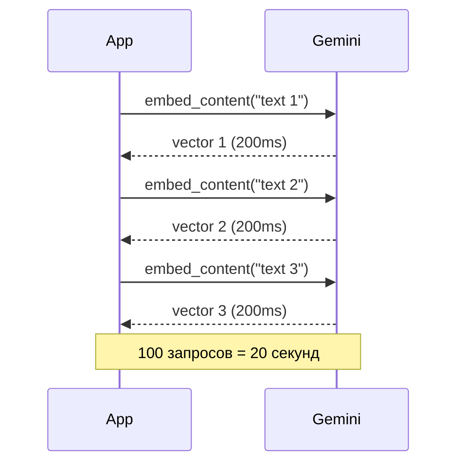
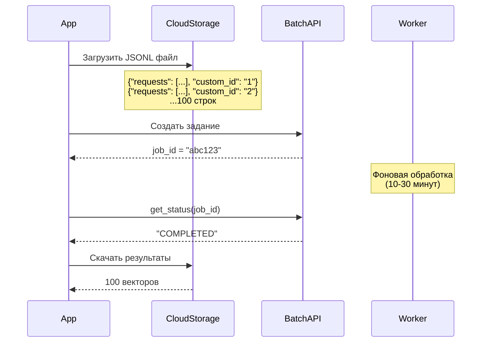

# 💰 Google Batch API: 50% экономии на векторизации

> Почему асинхронная обработка стоит в 2 раза дешевле

---

## 📌 Что это такое?

**Google Batch API** — это специальный endpoint Gemini API для обработки больших объёмов запросов с отложенным получением результатов. Вместо мгновенного ответа ты отправляешь задание в очередь и получаешь результаты через 10-30 минут.

Простая идея: **меньше приоритет = меньше цена**.

---

## 🎯 Зачем это нужно?

**Проблема: Высокая стоимость мгновенной векторизации**

Обычный Gemini API (`embed_content`) работает в режиме "request-response":

```
Ты отправляешь текст → Google сразу обрабатывает → возвращает вектор
```

**Цена:** $0.025 за 1 миллион токенов.

Для базы знаний из 10,000 документов (avg 500 токенов):

```
10,000 × 500 = 5M токенов
5M × $0.025 = $125
```

Если переиндексируешь базу раз в месяц → **$1,500 в год только на векторы**.

---

**Решение: Batch API с отложенной обработкой**

Google предлагает: "Если ты готов подождать — получишь скидку 50%".

**Цена:** $0.0125 за 1 миллион токенов.

Та же база знаний через Batch API:

```
5M × $0.0125 = $62.50
```

**Экономия: $62.50 в месяц, $750 в год!**

---

## 🔍 Как это работает?

### Обычный API (Sync)



**Характеристики:**

- ✅ Мгновенные результаты (~200ms на запрос)
- ❌ Дорого ($0.025/1M tokens)
- ❌ Rate limits (1500 RPM)

---

### Batch API (Async)



**Характеристики:**

- ✅ Дёшево ($0.0125/1M tokens)
- ✅ Нет rate limits (можешь отправить миллионы запросов)
- ❌ Задержка 10-30 минут

---

## 📊 Экономика: Когда Batch API выгоден?

| Сценарий | Документов | Sync стоимость | Batch стоимость | Экономия |
|----------|-----------|----------------|-----------------|----------|
| Ручное создание | 10 | $0.0125 | $0.00625 | **50%** ($0.00625) |
| Импорт статей | 1,000 | $1.25 | $0.625 | **50%** ($0.625) |
| База знаний | 10,000 | $12.50 | $6.25 | **50%** ($6.25) |
| Корпоративный архив | 100,000 | $125 | $62.50 | **50%** ($62.50) |

**Важно:** Экономия **всегда 50%**, независимо от объёма!

---

### Break-even анализ

**Вопрос:** При каком объёме Batch API начинает окупаться?

**Ответ:** Уже с **первого запроса**, но есть нюансы:

**Trade-offs:**

| Фактор | Sync | Batch |
|--------|------|-------|
| **Цена** | 💰💰 Дорого | 💰 Дёшево |
| **Латентность** | 🚀 200ms | 🐢 10-30 минут |
| **Инфраструктура** | ✅ Простая | ⚠️ Нужен worker + cloud storage |
| **Rate limits** | ⚠️ 1500 RPM | ✅ Неограничено |

**Рекомендация:**

- **< 100 документов:** Используй sync (простота важнее экономии)
- **100-10,000 документов:** Используй batch (экономия заметна)
- **> 10,000 документов:** Batch обязателен (sync упрётся в rate limits)

---

## ⚠️ Важные нюансы

### 1. JSONL формат — почему не JSON?

**Google Batch API требует JSONL** (JSON Lines), где каждая строка — отдельный запрос.

**Почему не обычный JSON массив?**

```json
// ❌ ПЛОХО: Обычный JSON массив
[
  {"requests": [...], "custom_id": "1"},
  {"requests": [...], "custom_id": "2"}
]
```

**Проблема:** Google должен загрузить **весь файл в память** перед обработкой. Для 1M запросов это гигабайты RAM.

```jsonl
// ✅ ХОРОШО: JSONL формат
{"requests": [...], "custom_id": "1"}
{"requests": [...], "custom_id": "2"}
```

**Преимущество:** Google читает файл **построчно** (streaming), обрабатывает параллельно.

**Аналогия:** Как assembly line на заводе — детали приходят по конвейеру, а не все сразу.

---

### 2. Custom ID — как сопоставить результаты?

**Проблема:** Batch API возвращает результаты в **произвольном порядке**.

Ты отправил:

```jsonl
{"custom_id": "chunk_123", ...}
{"custom_id": "chunk_456", ...}
```

Google может вернуть:

```jsonl
{"custom_id": "chunk_456", "embedding": [...]}
{"custom_id": "chunk_123", "embedding": [...]}
```

**Решение:** Используй `custom_id = f"chunk_{chunk.id}"` для маппинга результатов обратно в БД.

---

### 3. Partial failures — что если часть запросов провалилась?

**Сценарий:** Отправил 1000 запросов, 5 провалились (токен-лимит, invalid text).

**Поведение Google:**

- ✅ 995 запросов обработаны успешно
- ❌ 5 запросов вернули error в результатах

**Решение:**

1. Batch API возвращает **отдельный status для каждого custom_id**
2. BatchManager обрабатывает успешные → обновляет векторы
3. Проваленные → записывает `error_message` в чанк
4. Worker может **retry** проваленные чанки позже

---

### 4. Quota limits — когда Batch API тоже упирается?

**Google Batch API не имеет RPM лимитов**, но есть другие ограничения:

| Лимит | Значение |
|-------|----------|
| Max requests per batch | 10,000 |
| Max file size | 100 MB |
| Max concurrent jobs | 50 |

**Что делать при 100,000 документов?**

**Решение:** Разделить на батчи по 10K:

```
Batch 1: chunks 1-10,000   → job_id_1
Batch 2: chunks 10,001-20,000 → job_id_2
...
Batch 10: chunks 90,001-100,000 → job_id_10
```

BatchManager автоматически делает это через `flush_queue(min_size=100)`.

---

## 🎓 Аналогия из жизни

Представь авиакомпанию с двумя тарифами:

**Sync API** — "Бизнес-класс":

- ✅ Приоритетная посадка (мгновенный ответ)
- ✅ Гарантированное место
- ❌ Билет стоит $500

**Batch API** — "Эконом с standby":

- ✅ Билет стоит $250 (50% дешевле)
- ✅ Ты полетишь, но неизвестно когда (10-30 минут задержки)
- ⚠️ Нужно подождать свободного места

Если ты не торопишься — зачем переплачивать?

---

## 🔗 Следующий шаг

Теперь ты понимаешь **экономику** Batch API. Но **как именно** координируется очередь локально в SQLite?

→ [**22. BatchManager: Локальная оркестрация**](22_batch_manager.md)

---

**← [Назад к оглавлению](00_overview.md)**
