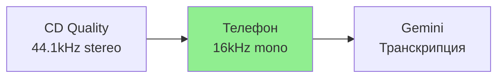
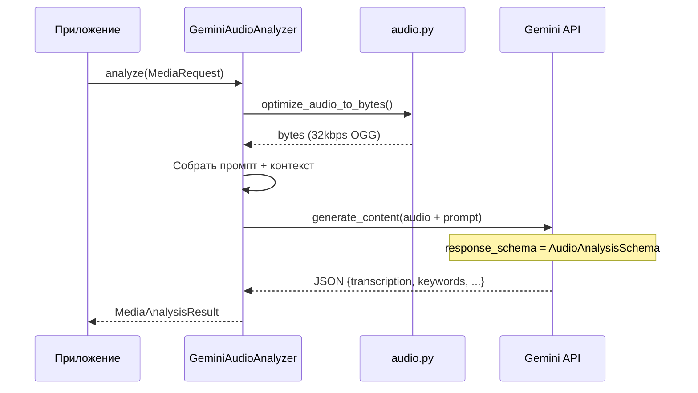

# 🎙️ Audio Analysis Architecture

> Как Gemini превращает аудио в текст для семантического поиска

---

## 📌 Что это такое?

**GeminiAudioAnalyzer** — адаптер для транскрипции и анализа аудио через Gemini API:

1. Принимает путь к аудио-файлу
2. Оптимизирует до 32kbps mono OGG
3. Отправляет inline в Gemini
4. Получает транскрипцию и метаданные

Результат: текстовое представление аудио для векторизации и поиска.

---

## 🎯 Зачем это нужно?

**Проблема**: Подкасты, лекции, встречи — всё это аудио, недоступное для текстового поиска.

**Решение**: Gemini транскрибирует аудио и извлекает:

- **Полную транскрипцию** (для векторизации)
- **Краткое описание** (summary)
- **Ключевые слова** (для FTS5)
- **Участников** (если упоминаются)
- **Action items** (задачи из обсуждения)

---

## 🧮 Экономика: 83 минуты в одном запросе

### Проблема лимитов

Gemini inline upload ограничен **20 MB**. Без оптимизации:

| Формат | Битрейт | 20 MB хватит на |
|--------|---------|-----------------|
| WAV (CD) | 1411 kbps | ~2 минуты |
| MP3 192 | 192 kbps | ~14 минут |
| MP3 128 | 128 kbps | ~21 минуту |

**Этого мало** для подкаста или лекции.

---

### Решение: Агрессивная оптимизация

Параметры по умолчанию:

| Параметр | Значение | Зачем |
|----------|----------|-------|
| Битрейт | 32 kbps | 20 MB / (32000/8) = **5000 сек** |
| Каналы | Mono | Gemini не различает стерео |
| Sample rate | 16 kHz | Достаточно для речи |
| Кодек | libvorbis (OGG) | Лучше MP3 на низких битрейтах |

**Результат**: 20 MB вмещает **83 минуты** аудио!

---

### Почему 32 kbps достаточно?



- Gemini анализирует **смысл речи**, а не качество звука
- 16 kHz — стандарт телефонии, проверенный десятилетиями
- Потери при сжатии **не влияют** на качество транскрипции

---

## 🔍 Как это работает?



---

## 📦 Structured Output

### Схема ответа

| Поле | Тип | Описание |
|------|-----|----------|
| `transcription` | string | Полная транскрипция речи |
| `description` | string | Краткое резюме (2-4 предложения) |
| `keywords` | array[string] | 5-10 ключевых слов |
| `participants` | array[string] | Имена спикеров (если упоминаются) |
| `action_items` | array[string] | Задачи и follow-up пункты |

### Пример результата

```json
{
  "transcription": "Добрый день! Сегодня обсуждаем архитектуру семантического поиска...",
  "description": "Запись встречи по обсуждению архитектуры поисковой системы",
  "keywords": ["семантический поиск", "эмбеддинги", "SQLite", "Gemini"],
  "participants": ["Владимир", "Иван"],
  "action_items": ["Подготовить схему БД", "Написать тесты"]
}
```

---

## ⚙️ Выбор модели

| Модель | Цена (1M токенов) | Качество | Рекомендация |
|--------|-------------------|----------|--------------|
| `gemini-2.5-flash-lite` | $0.02 | ✅ Достаточно | **По умолчанию** |
| `gemini-2.5-flash` | $0.10 | ✅✅ Хорошо | Сложный контент |
| `gemini-2.5-pro` | $1.25 | ✅✅✅ Отлично | Редко нужен |

**Почему flash-lite?**

- В **4x дешевле** обычного Flash
- Транскрипция — относительно простая задача
- Качество распознавания практически идентичное

---

## 📊 Сравнение с альтернативами

| Критерий | Gemini Audio | Whisper API | Whisper Local |
|----------|--------------|-------------|---------------|
| Стоимость | $0.02/1M токенов | $0.006/мин | Бесплатно |
| Скорость | ~0.5x realtime | ~0.3x realtime | Зависит от GPU |
| Качество RU | ✅ Отлично | ✅ Отлично | ✅ Отлично |
| Structured output | ✅ Native | ❌ Только текст | ❌ Только текст |
| Keywords/summary | ✅ Да | ❌ Нет | ❌ Нет |
| Лимит длины | 83 мин inline | 25 MB | Неограничен |

**Вывод**: Gemini выигрывает по structured output и дополнительной аналитике.

---

## 🎵 Поддерживаемые форматы

| Формат | MIME-тип | Поддержка |
|--------|----------|-----------|
| MP3 | audio/mpeg | ✅ |
| WAV | audio/wav | ✅ |
| OGG | audio/ogg | ✅ |
| FLAC | audio/flac | ✅ |
| AAC | audio/aac | ✅ |
| M4A | audio/x-m4a | ✅ |
| WebM | audio/webm | ✅ |

**Внутренняя конвертация**: Любой формат → OGG 32kbps mono.

---

## ⚠️ Важные нюансы

### 1. Зависимость от FFmpeg

Аудио-оптимизация требует **ffmpeg** в системе:

```bash
# macOS
brew install ffmpeg

# Ubuntu/Debian
apt install ffmpeg
```

Без ffmpeg: `DependencyError` с инструкциями по установке.

---

### 2. Языковая поддержка

Gemini автоматически определяет язык. Поддерживает:

- Русский ✅
- Английский ✅
- Смешанная речь ✅

**Совет**: Если язык известен, добавьте в контекст:

```python
request = MediaRequest(
    resource=resource,
    context_text="Язык: русский. Тема: программирование."
)
```

---

### 3. Тишина и шум

Gemini корректно обрабатывает:

- Тишину (возвращает пустую транскрипцию)
- Фоновый шум (игнорирует)
- Музыку без речи (описывает как музыку)

---

### 4. Длинное аудио (>83 мин)

Для аудио длиннее 83 минут:

1. **File Upload API** — загрузка файла на сервер Gemini
2. **Нарезка** — разбить на части и склеить транскрипции

Текущая реализация: только inline (до 83 мин).

---

## 🔗 Связанные документы

- **Предыдущий**: [Media Queue Processor](29_media_queue_processor.md)
- **Следующий**: [Video Multimodal Analysis](31_video_multimodal_analysis.md)
- **Resilience**: [Resilience Patterns](27_resilience_patterns.md)

---

**← [Media Queue Processor](29_media_queue_processor.md)** | **[Video Multimodal Analysis](31_video_multimodal_analysis.md) →**
