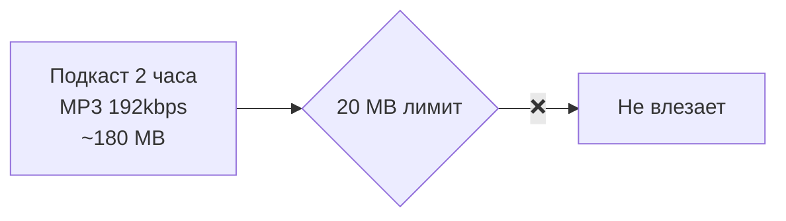
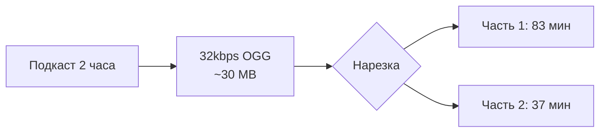
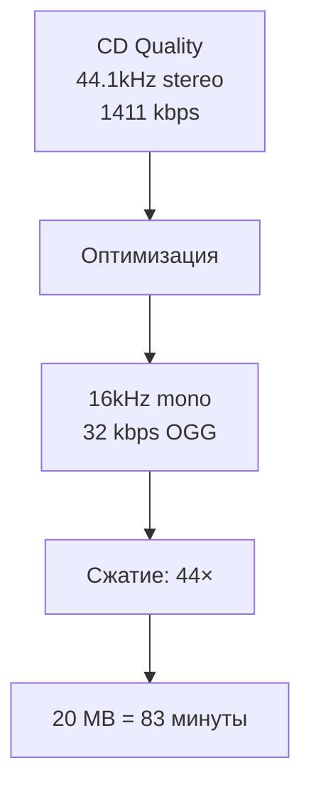
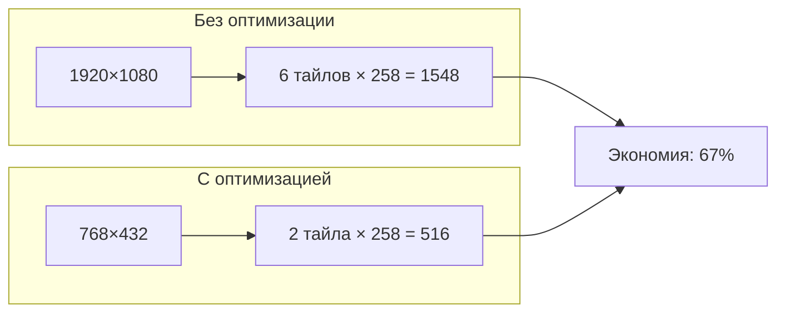
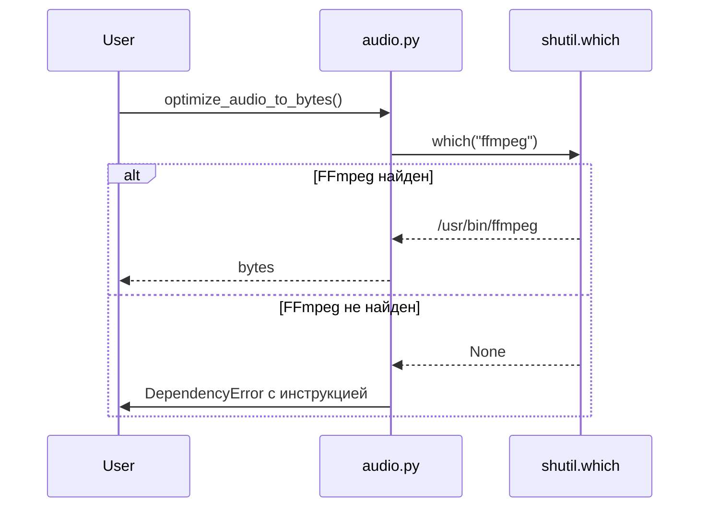

# ⚡ Media Optimization Strategies

> Как оптимизировать аудио и видео для максимальной эффективности с Gemini API

---

## 📌 Что это такое?

**Media Optimization** — набор утилит и стратегий для:

1. Сжатия аудио до минимального размера
2. Уменьшения кадров видео до оптимальных размеров
3. Управления системными зависимостями (ffmpeg)

Цель: **максимум контента в лимитах API при минимальных затратах**.

---

## 🎯 Зачем оптимизировать?

### Лимиты Gemini

| Лимит | Значение | Влияние |
|-------|----------|---------|
| Inline upload | 20 MB | Ограничивает длину аудио |
| Токены изображений | По тайлам | Влияет на стоимость |
| RPM (Free Tier) | 15 req/min | Throttling |

### Без оптимизации



### С оптимизацией



---

## 🎵 Audio Optimization

### Стратегия: Агрессивное сжатие

Дефолтные параметры в `audio.py`:

| Параметр | Значение | Зачем |
|----------|----------|-------|
| `DEFAULT_BITRATE` | 32 kbps | Максимальная вместимость |
| `DEFAULT_CODEC` | libvorbis | Лучше MP3 на низких битрейтах |
| `DEFAULT_SAMPLE_RATE` | 16000 Hz | Достаточно для речи |
| `DEFAULT_MONO` | True | Gemini не различает стерео |

---

### Почему именно эти значения?



| Шаг | Что делаем | Потери качества |
|-----|------------|-----------------|
| Stereo → Mono | -50% данных | ❌ Нет (Gemini конвертирует) |
| 44.1kHz → 16kHz | -64% данных | ⚠️ Минимальные (речь 4-8kHz) |
| 192kbps → 32kbps | -83% данных | ⚠️ Заметные (но речь ОК) |

---

### Сравнение кодеков

| Кодек | 32 kbps качество | Совместимость |
|-------|------------------|---------------|
| OGG/Vorbis | ✅ Хорошо | ✅ pydub, ffmpeg |
| Opus | ✅✅ Отлично | ⚠️ Не везде |
| MP3 | ⚠️ Плохо | ✅ Везде |
| AAC | ✅ Хорошо | ⚠️ Лицензия |

**Выбор**: OGG/Vorbis — баланс качества и совместимости.

---

### API утилит

```python
# Извлечение аудио из видео
from semantic_core.infrastructure.media.utils.audio import (
    extract_audio_from_video,
    optimize_audio_to_bytes,
    get_audio_duration,
)

# Видео → Аудио файл
audio_path = extract_audio_from_video(
    video_path="lecture.mp4",
    output_format="ogg",
    bitrate=32,
    mono=True
)

# Аудио → Bytes для inline upload
audio_bytes, mime_type = optimize_audio_to_bytes("podcast.mp3")
# → (bytes, "audio/ogg")

# Длительность
duration = get_audio_duration("speech.wav")  # → 125.5 (секунды)
```

---

## 🎬 Video Frame Optimization

### Стратегия: Уменьшение кадров

Пресеты качества в `video.py`:

| Preset | Max Dimension | Токенов на кадр | Назначение |
|--------|---------------|-----------------|------------|
| `fhd` | 1024 px | ~774 | UI, код, мелкий текст |
| `hd` | 768 px | ~516 | **По умолчанию** |
| `balanced` | 512 px | ~258 | Длинные видео |

---

### Экономия токенов



### Реальные числа

| Сценарий | 10 кадров raw | 10 кадров hd | Экономия |
|----------|---------------|--------------|----------|
| 1080p видео | 15480 токенов | 5160 токенов | **67%** |
| 4K видео | 30960 токенов | 5160 токенов | **83%** |

---

### API утилит

```python
from semantic_core.infrastructure.media.utils.video import (
    extract_frames,
    frames_to_bytes,
    get_video_duration,
    QUALITY_PRESETS,
)

# Извлечение кадров
frames = extract_frames(
    video_path="tutorial.mp4",
    mode="total",           # total | fps | interval
    frame_count=10,         # для mode="total"
    quality="hd",           # fhd | hd | balanced
    max_frames=50,          # защита от переполнения
)
# → List[PIL.Image]

# Конвертация для API
frame_bytes = frames_to_bytes(frames, format="JPEG", quality=85)
# → List[Tuple[bytes, str]]  # (data, mime_type)

# Длительность
duration = get_video_duration("movie.mp4")  # → 3600.0 (секунды)
```

---

## 🔧 FFmpeg Dependency

### Проблема

Обе утилиты (`audio.py`, `video.py`) зависят от **ffmpeg**:

- `pydub` использует ffmpeg для конвертации аудио
- `imageio[pyav]` использует ffmpeg для декодирования видео

---

### Решение: DependencyError

```python
class DependencyError(Exception):
    """Отсутствует системная зависимость."""
    pass

def ensure_ffmpeg() -> None:
    """Проверяет наличие ffmpeg при первом обращении."""
    if shutil.which("ffmpeg") is None:
        raise DependencyError(
            "ffmpeg not found in PATH.\n"
            "Install: brew install ffmpeg (macOS) or apt install ffmpeg (Linux)"
        )
```

---

### User Experience



**Результат**: Пользователь получает понятное сообщение, а не криптичную ошибку pydub.

---

## 📊 Сравнение стратегий

### Аудио: Битрейт vs Качество

| Битрейт | 1 час аудио | Качество речи | Рекомендация |
|---------|-------------|---------------|--------------|
| 128 kbps | 57 MB ❌ | ✅✅✅ Отлично | Не влезет |
| 64 kbps | 28.5 MB ⚠️ | ✅✅ Хорошо | 2 части |
| 32 kbps | 14 MB ✅ | ✅ Достаточно | **Рекомендуется** |
| 16 kbps | 7 MB ✅ | ⚠️ Ухудшение | Не рекомендуется |

---

### Видео: Качество vs Токены

| Preset | 1080p → | Токенов | Качество анализа |
|--------|---------|---------|------------------|
| `fhd` | 1024 px | 774 | ✅✅ Хорошо для OCR |
| `hd` | 768 px | 516 | ✅ Достаточно |
| `balanced` | 512 px | 258 | ⚠️ Мелкий текст страдает |

---

## ⚠️ Важные нюансы

### 1. Когда НЕ оптимизировать

| Сценарий | Оптимизация | Причина |
|----------|-------------|---------|
| OCR мелкого текста | `fhd` | Нужно качество |
| Аудиокниги (качество важно) | 64 kbps | Слушатели привыкли |
| Короткие клипы (<1 мин) | Не нужна | И так влезают |

---

### 2. Pillow для изображений

Утилиты видео используют Pillow для ресайза:

```python
from PIL import Image

def _resize_frame(img: Image.Image, max_dim: int) -> Image.Image:
    if max(img.size) <= max_dim:
        return img  # Не ресайзить маленькие
    
    ratio = max_dim / max(img.size)
    new_size = (int(img.width * ratio), int(img.height * ratio))
    return img.resize(new_size, Image.Resampling.LANCZOS)
```

---

### 3. Сохранение пропорций

Ресайз **всегда** сохраняет пропорции:

| Исходный | max_dim=768 | Результат |
|----------|-------------|-----------|
| 1920×1080 | 768×432 | Пропорции OK |
| 1080×1920 | 432×768 | Вертикальное OK |
| 1000×1000 | 768×768 | Квадрат OK |

---

## 🔗 Связанные документы

- **Предыдущий**: [Video Multimodal Analysis](31_video_multimodal_analysis.md)
- **Аудио анализ**: [Audio Analysis Architecture](30_audio_analysis_architecture.md)
- **Токены изображений**: [Gemini Vision Integration](26_gemini_vision_integration.md)

---

**← [Video Multimodal Analysis](31_video_multimodal_analysis.md)** | **[00_overview.md](00_overview.md) →**
