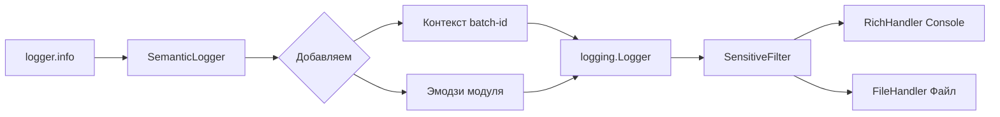
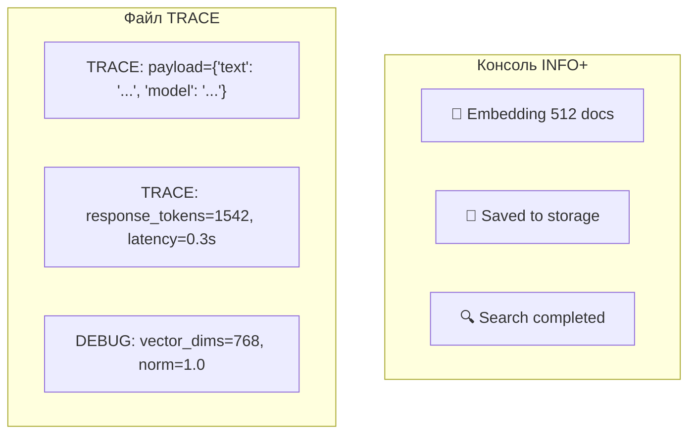
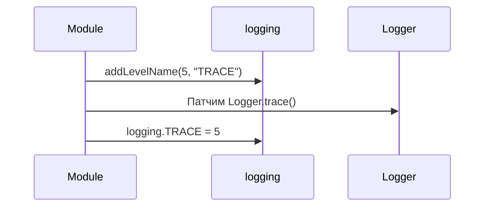
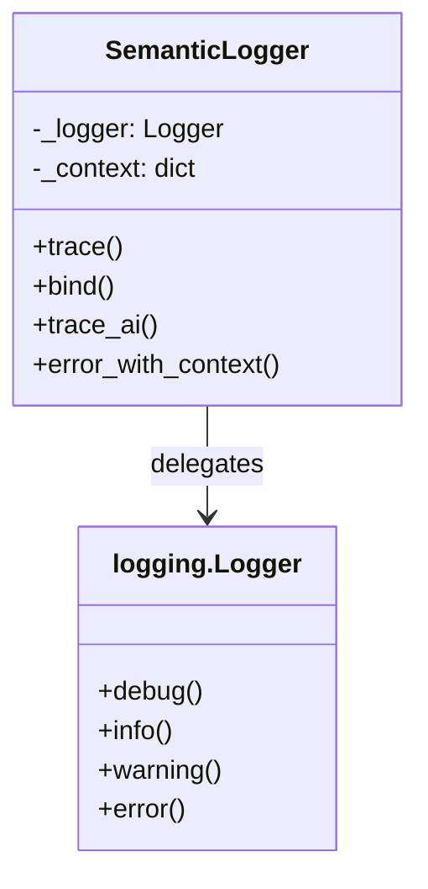
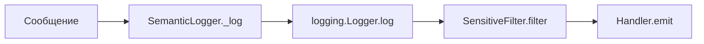
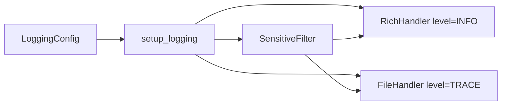

# 📊 Semantic Logging Architecture

> Dual-mode logging: Console (INFO+) для разработчика, File (TRACE) для AI-агентов

---

## 📌 Что это такое?

**Semantic Logging** — архитектура логирования, оптимизированная для двух аудиторий:

- **Человек** (консоль): краткие сообщения с эмодзи, уровень INFO+
- **AI-агент** (файл): детальные дампы с TRACE-уровнем для анализа

---

## 🎯 Зачем это нужно?

**Проблема**: Стандартные логи не подходят ни тем, ни другим:

| Аудитория | Что нужно | Стандартный logging |
|-----------|-----------|---------------------|
| Разработчик | Краткие статусы, цвета | ❌ Монотонный текст |
| AI-агент | Полные пейлоады, промпты | ❌ Обрезанные сообщения |
| Debug | Что происходит внутри | ❌ Слишком шумно или тихо |

**Решение**: Раздельные хендлеры с разными уровнями и форматами.

---

## 🔍 Архитектура

### Поток сообщения



---

### Два хендлера — две аудитории



---

## 📐 Уровень TRACE

### Зачем нужен уровень ниже DEBUG?

| Уровень | Значение | Назначение |
|---------|----------|------------|
| DEBUG | 10 | "Что происходит" — шаги алгоритма |
| **TRACE** | **5** | "Что внутри" — дампы данных |

**TRACE используется для**:

- Полный текст промпта в LLM
- Сырой JSON-ответ от API  
- Векторы (первые N элементов)
- Размеры батчей, токены

---

### Регистрация уровня



**Результат**: `logger.trace("payload", data=payload)` работает как встроенный метод.

---

## 🏗️ Adapter Pattern

### Почему не наследование?

❌ **Наследование от Logger** — сложно:

- Logger создаётся через `logging.getLogger()`, не через конструктор
- Нужно переопределять Manager, Factory...
- Ломает совместимость с библиотеками

✅ **Adapter (обёртка)** — просто:

- Оборачиваем существующий Logger
- Добавляем свои методы (`bind()`, `trace_ai()`)
- Делегируем стандартные вызовы

---

### Диаграмма адаптера



---

## 🛡️ SensitiveFilter

### Позиция в pipeline



**Важно**: Filter мутирует `record.msg` и `record.args` **до** передачи в Handler.

---

### Что маскируется

| Тип ключа | Паттерн | Пример |
|-----------|---------|--------|
| Google API | `AIza...` | `AIzaSyD...abc → ***REDACTED***` |
| OpenAI | `sk-...` | `sk-proj-abc... → ***REDACTED***` |
| Groq | `gsk_...` | `gsk_abc123... → ***REDACTED***` |
| Bearer | `bearer ...` | `bearer eyJ... → ***REDACTED***` |

---

## 📊 Сравнение подходов

| Аспект | print() | logging | SemanticLogger |
|--------|---------|---------|----------------|
| Уровни | ❌ Нет | ✅ 5 уровней | ✅ 6 уровней (TRACE) |
| Фильтрация | ❌ Нет | ⚠️ По уровню | ✅ По уровню + секреты |
| Контекст | ❌ Вручную | ⚠️ extra={} | ✅ bind() автоматически |
| Вывод | stdout | Настраиваемый | Dual: Console + File |
| AI-friendly | ❌ | ⚠️ | ✅ TRACE для дампов |

---

## ⚙️ Конфигурация

### LoggingConfig (Pydantic)

| Параметр | По умолчанию | Описание |
|----------|--------------|----------|
| `level` | "INFO" | Уровень для консоли |
| `file_level` | "TRACE" | Уровень для файла |
| `log_file` | None | Путь к файлу (опционально) |
| `redact_secrets` | True | Маскировать API-ключи |
| `console_width` | 120 | Ширина консоли Rich |

---

### Пример настройки



---

## ⚠️ Важные нюансы

### 1. RichHandler особенности

❌ **RichHandler игнорирует Formatter.format()**

Он вызывает `getMessage()` напрямую, поэтому эмодзи добавляем в сообщение, не в Formatter.

### 2. markup=False обязательно

Rich интерпретирует `[batch-123]` как style tag. Отключаем:

```
RichHandler(markup=False)
```

### 3. Ленивая инициализация

`get_logger()` вызывает `setup_logging()` только при первом обращении. Повторные вызовы возвращают существующий логгер.

---

## 🔗 Связанные документы

- **Следующий**: [Visual Semantics in Logs](36_visual_semantics_logs.md) — эмодзи и форматирование
- **Контекст**: [Context Propagation](37_context_propagation.md) — bind() и проброс ID
- **Безопасность**: [Secret Redaction](38_secret_redaction.md) — маскирование ключей

---

**[Visual Semantics in Logs](36_visual_semantics_logs.md) →**
