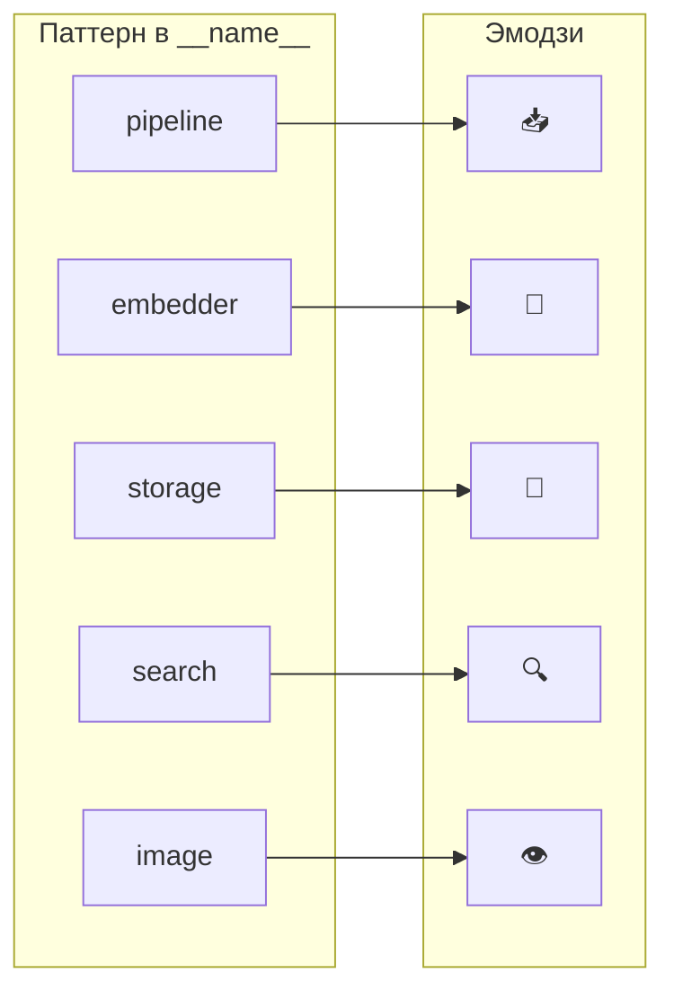
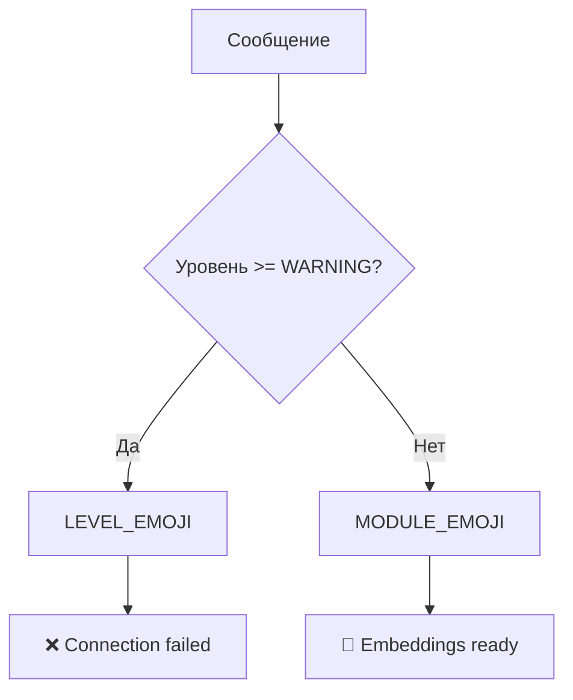
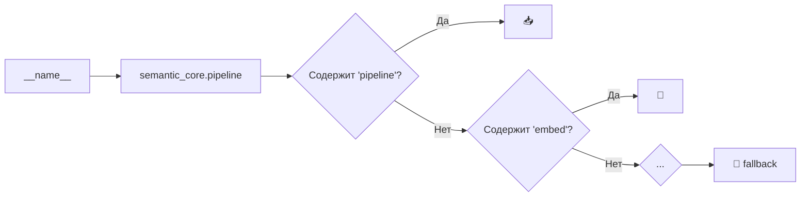
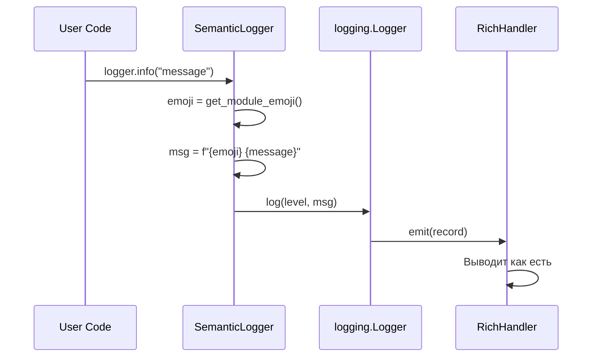
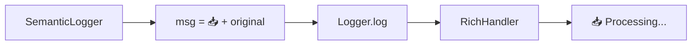

# 👁️ Visual Semantics in Logs

> EMOJI_MAP: мгновенная идентификация модуля и уровня через визуальные маркеры

---

## 📌 Что это такое?

**Visual Semantics** — использование эмодзи как семантических маркеров в логах:

- 📥 = pipeline/ingestion
- 🧠 = embedder/AI
- 💾 = storage/database
- ❌ = error

Глаз находит нужное за **0.1 секунды** вместо чтения текста.

---

## 🎯 Зачем это нужно?

**Проблема**: Текстовые логи требуют **чтения**:

```
2024-12-03 10:15:32 INFO semantic_core.pipeline Processing document
2024-12-03 10:15:33 INFO semantic_core.embedder Generated embeddings
2024-12-03 10:15:33 ERROR semantic_core.storage Connection failed
2024-12-03 10:15:34 INFO semantic_core.pipeline Retry initiated
```

Нужно прочитать каждую строку, чтобы понять "где ошибка?".

**Решение**: Визуальные маркеры:

```
📥 Processing document
🧠 Generated embeddings  
❌ Connection failed
📥 Retry initiated
```

Ошибка видна **мгновенно** — красный крестик выделяется.

---

## 🔍 EMOJI_MAP

### Маппинг модулей



---

### Полная таблица

| Паттерн | Эмодзи | Семантика |
|---------|--------|-----------|
| `pipeline`, `core` | 📥 | Ingestion — загрузка данных |
| `parser`, `markdown` | 🧶 | Parsing — разбор структуры |
| `splitter` | ✂️ | Splitting — нарезка на чанки |
| `embed`, `gemini` | 🧠 | AI — векторизация |
| `batch`, `queue` | 📦 | Queue — очередь задач |
| `storage`, `peewee` | 💾 | Storage — база данных |
| `search` | 🔍 | Search — поиск |
| `image`, `vision` | 👁️ | Vision — анализ изображений |
| `audio` | 🎙️ | Audio — аудио обработка |
| `video` | 🎬 | Video — видео обработка |
| `rate`, `limit` | 🛡️ | Protection — защита API |
| *fallback* | 📌 | Unknown — неизвестный модуль |

---

## 🎭 LEVEL_EMOJI

### Уровни ошибок

| Уровень | Эмодзи | Когда используется |
|---------|--------|-------------------|
| CRITICAL | 💀 | Система падает |
| ERROR | ❌ | Операция провалилась |
| WARNING | ⚠️ | Что-то подозрительно |
| DEBUG | 🔧 | Технические детали |
| TRACE | 🔬 | Микроскопический уровень |

**Примечание**: INFO не имеет своего эмодзи — используется эмодзи модуля.

---

### Приоритет эмодзи



**Логика**: Ошибки важнее модуля — показываем ❌/⚠️ вместо модульного эмодзи.

---

## 📐 Алгоритм get_module_emoji()

### Как определяется эмодзи



**Особенность**: Проверка идёт по **вхождению подстроки**, не по точному совпадению:

- `semantic_core.infrastructure.gemini.embedder` → содержит `embed` → 🧠
- `semantic_core.processing.parsers.markdown` → содержит `parser` → 🧶

---

## 🎨 Форматирование сообщения

### Структура итогового сообщения

```
{emoji} [{context_ids}] {original_message}
```

**Примеры**:

| Компоненты | Результат |
|------------|-----------|
| 📥 + batch-123 + "Loaded" | `📥 [batch-123] Loaded` |
| 🧠 + doc-42/chunk-5 + "Embedded" | `🧠 [doc-42/chunk-5] Embedded` |
| ❌ + task-99 + "Failed" | `❌ [task-99] Failed` |

---

### Где добавляется эмодзи



**Важно**: Эмодзи добавляется в `SemanticLogger._log()`, не в Formatter.

---

## ⚠️ RichHandler Quirks

### Проблема с Formatter

❌ **RichHandler игнорирует `Formatter.format()`**:

Он вызывает `record.getMessage()` напрямую и форматирует сам. Кастомный Formatter не работает.

✅ **Решение**: Добавляем эмодзи в **сообщение**, до передачи в Logger:



---

## 📊 Визуальное сканирование

### Пример лога

```
📥 Starting pipeline for 5 documents
🧶 Parsing markdown structure
✂️ Split into 23 chunks
🧠 Generating embeddings...
🧠 [batch-001] Batch sent to Gemini
⚠️ [batch-001] Rate limit warning, backing off
🧠 [batch-001] Embeddings received
💾 Storing 23 vectors
🔍 Index ready for search
```

**Паттерн чтения**:

1. Глаз скользит по левому краю (эмодзи)
2. ⚠️ сразу привлекает внимание
3. Читаем только нужные строки

---

### Сравнение с текстовым логом

| Эмодзи лог | Текстовый лог |
|------------|---------------|
| 📥 Starting... | INFO semantic_core.pipeline Starting... |
| ⚠️ Rate limit | WARNING semantic_core.embedder Rate limit |
| ❌ Failed | ERROR semantic_core.storage Failed |

**Экономия**: ~40% ширины строки, мгновенная идентификация.

---

## ⚠️ Важные нюансы

### 1. Консистентность маппинга

Один модуль = один эмодзи. Если `embedder` = 🧠, то везде 🧠.

### 2. Fallback для новых модулей

Новый модуль без маппинга получает 📌. Это сигнал добавить в EMOJI_MAP.

### 3. Не перегружать

15 паттернов достаточно. Больше — теряется смысл визуального различения.

---

## 🔗 Связанные документы

- **Предыдущий**: [Semantic Logging Architecture](35_semantic_logging.md)
- **Следующий**: [Context Propagation](37_context_propagation.md) — bind() и `[batch-id]`
- **Безопасность**: [Secret Redaction](38_secret_redaction.md)

---

**← [Semantic Logging Architecture](35_semantic_logging.md)** | **[Context Propagation](37_context_propagation.md) →**
