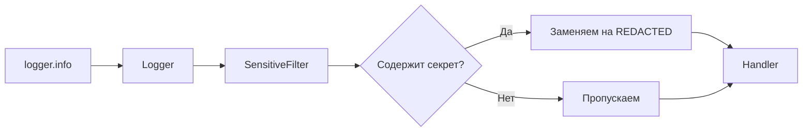
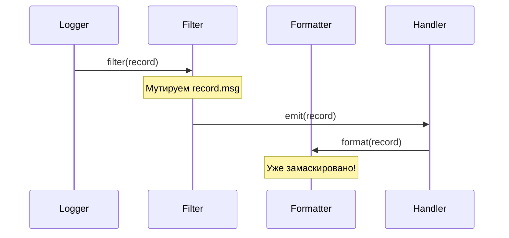
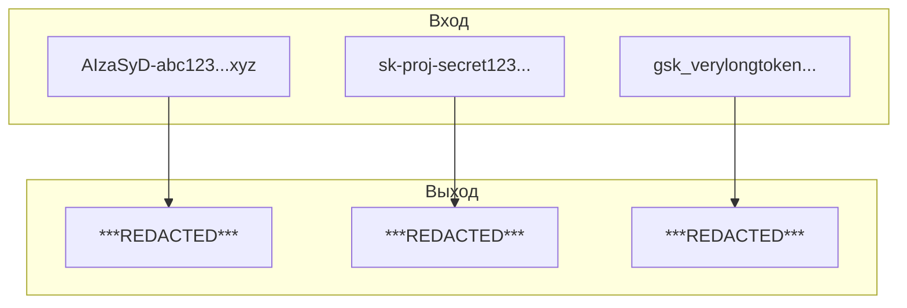
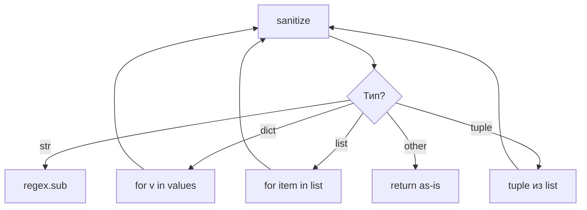
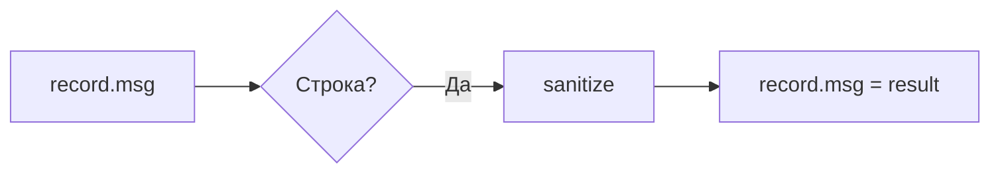
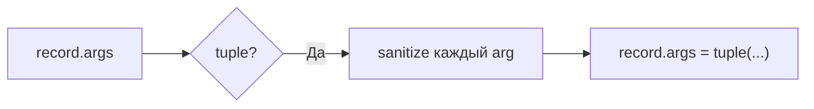
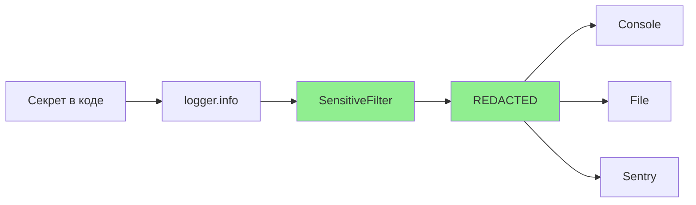

# 🔐 Secret Redaction in Logs

> SensitiveDataFilter: автоматическое маскирование API-ключей на уровне Filter

---

## 📌 Что это такое?

**Secret Redaction** — механизм автоматического поиска и замены секретных данных (API-ключей, токенов) на `***REDACTED***` в логах.

Работает прозрачно, без изменения кода логирования.

---

## 🎯 Зачем это нужно?

**Проблема**: API-ключи утекают в логи:

```
DEBUG: Request headers: {'Authorization': 'Bearer AIzaSyD...xyz'}
ERROR: API call failed with key sk-proj-abc123...
```

Логи отправляются в Sentry, сохраняются в файлах, видны в консоли.

**Последствия**:

- Финансовые потери (чужое использование)
- Компрометация аккаунта
- Нарушение compliance (PCI DSS, SOC2)

**Решение**: Маскирование на уровне logging.Filter.

---

## 🔍 Архитектура

### Позиция в pipeline



---

### Почему Filter, а не Formatter?



**Причина**: Filter выполняется **до** Formatter и **до** Handler. Секрет не доходит до вывода.

---

## 🎭 Паттерны API-ключей

### Таблица паттернов

| Провайдер | Префикс | Длина | Regex |
|-----------|---------|-------|-------|
| Google | `AIza` | 39 | `AIza[0-9A-Za-z_-]{35}` |
| OpenAI | `sk-` | 51+ | `sk-[0-9a-zA-Z]{20,}` |
| OpenAI Project | `sk-proj-` | 50+ | `sk-proj-[0-9a-zA-Z_-]{20,}` |
| Groq | `gsk_` | 56+ | `gsk_[0-9a-zA-Z]{50,}` |
| xAI/Grok | `xai-` | 30+ | `xai-[0-9a-zA-Z]{20,}` |
| Bearer | `bearer` | varies | `bearer\s+[a-zA-Z0-9_-]{20,}` |

---

### Визуализация



---

## 📐 Рекурсивная обработка

### Что обрабатывается

| Тип данных | Обработка |
|------------|-----------|
| `str` | Прямая замена по regex |
| `dict` | Рекурсия по values |
| `list` | Рекурсия по элементам |
| `tuple` | Рекурсия → tuple |
| Остальное | Пропускаем |

---

### Диаграмма рекурсии



---

### Пример с вложенной структурой

**Вход**:

```python
{
    "config": {
        "api_key": "AIzaSyD-secret-key-here",
        "tokens": ["sk-abc123...", "safe-value"]
    }
}
```

**Выход**:

```python
{
    "config": {
        "api_key": "***REDACTED***",
        "tokens": ["***REDACTED***", "safe-value"]
    }
}
```

---

## 🔧 Где применяется Filter

### record.msg



### record.args



**Важно**: `args` используются для `%s` форматирования:

```python
logger.info("Key: %s", api_key)  # args = (api_key,)
```

---

## 📊 Примеры маскирования

### До и после

| Исходное сообщение | После фильтра |
|-------------------|---------------|
| `Using key AIzaSyD-abc...` | `Using key ***REDACTED***` |
| `Auth: Bearer eyJhbG...` | `Auth: ***REDACTED***` |
| `{"key": "sk-proj-..."}` | `{"key": "***REDACTED***"}` |
| `Safe message` | `Safe message` |

---

### Частичное маскирование

Маскируется **только ключ**, контекст сохраняется:

```
Request to https://api.openai.com with key sk-abc123... failed

↓

Request to https://api.openai.com with key ***REDACTED*** failed
```

---

## ⚠️ Важные нюансы

### 1. Порядок паттернов имеет значение

`sk-proj-` должен проверяться **до** `sk-`, иначе:

```
sk-proj-abc... → sk-***REDACTED***-abc...  ❌
```

**Решение**: Более специфичные паттерны — первыми.

---

### 2. False positives

Паттерн `sk-` может поймать не-ключи:

```
"Disk: 500GB" → OK
"Task-id: sk-something" → Может зацепить ⚠️
```

**Митигация**: Минимальная длина `{20,}` уменьшает ложные срабатывания.

---

### 3. Производительность

Regex на каждое сообщение — накладные расходы.

**Оптимизация**:

- Компилируем regex один раз при создании Filter
- Используем `re.IGNORECASE` только для `bearer`

---

### 4. Что НЕ маскируется

❌ **Не обрабатывается**:

- Ключи в exception stack traces
- Ключи в repr() объектов
- Бинарные данные

**Рекомендация**: Не передавать ключи в exception messages.

---

## 🔗 Конфигурация

### Включение/выключение

```python
LoggingConfig(
    redact_secrets=True  # По умолчанию
)
```

При `False` Filter не добавляется к handlers.

---

### Добавление своих паттернов

Расширение `SECRET_PATTERNS` в `filters.py`:

```python
SECRET_PATTERNS = [
    r"AIza[0-9A-Za-z_-]{35}",
    r"sk-[0-9a-zA-Z]{20,}",
    # Добавить свой:
    r"my-corp-key-[a-z0-9]{32}",
]
```

---

## 📈 Жизненный цикл секрета



Секрет **никогда не покидает** приложение.

---

## 🔗 Связанные документы

- **Предыдущий**: [Context Propagation](37_context_propagation.md)
- **Архитектура**: [Semantic Logging Architecture](35_semantic_logging.md)
- **Визуализация**: [Visual Semantics in Logs](36_visual_semantics_logs.md)

---

**← [Context Propagation](37_context_propagation.md)** | **[Вернуться к оглавлению](00_overview.md)**
