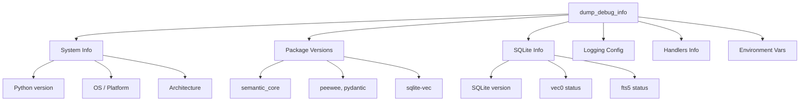
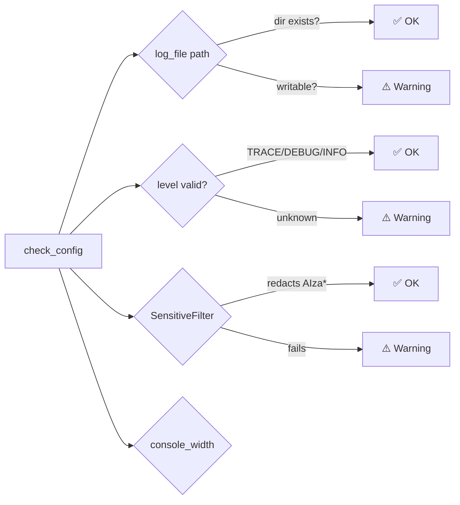
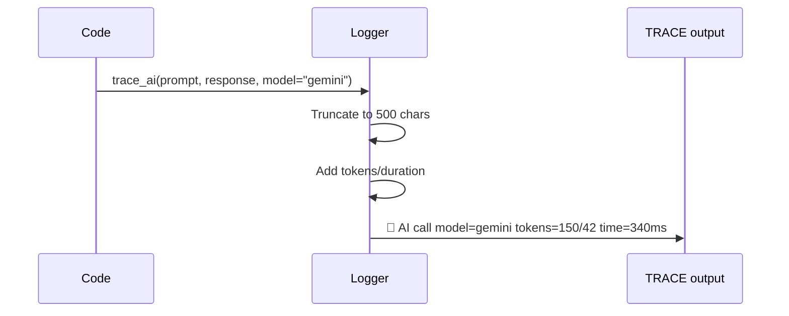
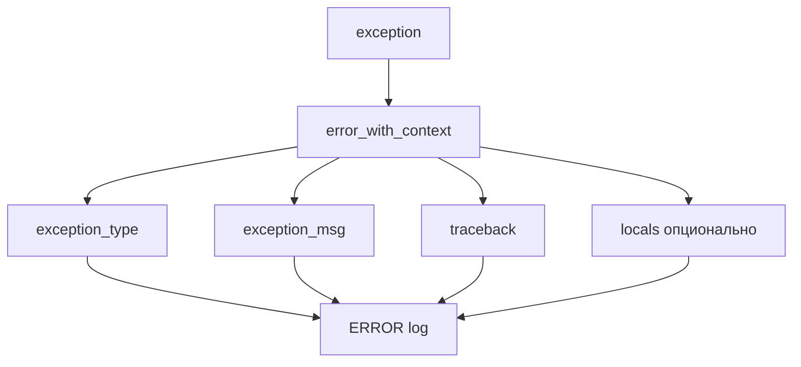
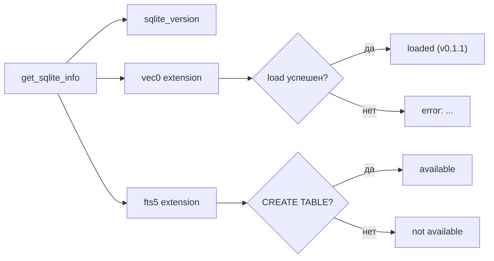
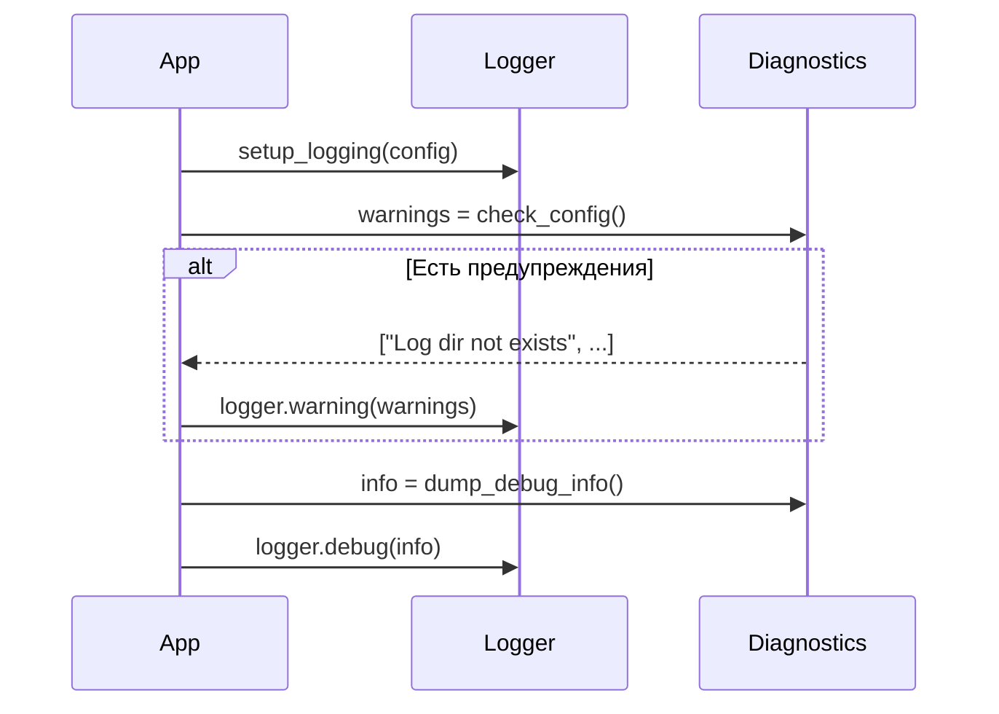

````markdown
# 🔧 Diagnostics & Debugging

> dump_debug_info(), check_config() и специализированные методы для troubleshooting

---

## 📌 Что это такое?

**Diagnostics Module** — набор утилит для сбора информации о системе, валидации конфигурации и расширенного логирования ошибок.

Когда что-то идёт не так — эти инструменты помогают понять "почему".

---

## 🎯 Зачем это нужно?

**Проблема**: Баг-репорт "у меня не работает" бесполезен:

```
User: Pipeline не запускается
Dev: Какая версия Python? Какая ОС? Какие пакеты? Какой конфиг?
User: Не знаю...
```

Нужен **автоматический сбор контекста**.

**Решение**: Одна функция собирает всё:

```
>>> from semantic_core.utils.logger import dump_debug_info
>>> print(dump_debug_info())

=== Semantic Core Debug Info ===
Python: 3.12.0
Platform: macOS-14.0-arm64
sqlite-vec: 0.1.1 (loaded)
Handlers: RichHandler(INFO), FileHandler(TRACE)
...
```

---

## 🔍 dump_debug_info()

### Что собирает



---

### Формат вывода

```
========================================
Semantic Core Debug Info
========================================
Generated: 2024-12-03T14:30:00

[System]
Python: 3.12.0
Platform: macOS-14.0-arm64-arm-64bit
Architecture: arm64
OS: Darwin 23.0.0

[Packages]
peewee: 3.17.0
pydantic: 2.5.0
rich: 13.7.0
semantic_core: 0.1.0
sqlite-vec: 0.1.1

[Logging Config]
level: INFO
file_level: TRACE
log_file: None (console only)
redact_secrets: True

[SQLite]
sqlite_version: 3.44.0
vec0: loaded (v0.1.1)
fts5: available

[Active Handlers]
1. RichHandler (level=INFO)
2. FileHandler (level=TRACE) → /logs/app.log
   Filters: SensitiveDataFilter

========================================
```

---

### Когда использовать

| Сценарий | Действие |
|----------|----------|
| Баг-репорт | Приложить вывод dump_debug_info() |
| CI/CD | Логировать при старте pipeline |
| Отладка | Проверить что vec0 загружен |
| Support | Запросить у пользователя |

---

## 🛡️ check_config()

### Что проверяет



---

### Возвращаемое значение

```python
warnings = check_config()

if warnings:
    for w in warnings:
        print(f"⚠️ {w}")
else:
    print("✅ Config OK")
```

**Пример предупреждений**:

```
⚠️ Log directory does not exist: /var/log/myapp
⚠️ Console width 60 is very narrow, may cause formatting issues
⚠️ SensitiveDataFilter is not redacting Google API keys
```

---

### Типичные проблемы

| Предупреждение | Причина | Решение |
|----------------|---------|---------|
| Directory not exists | Путь к log_file некорректен | Создать директорию |
| Not writable | Нет прав на запись | chmod / сменить путь |
| Invalid level | Опечатка в SEMANTIC_LOG_LEVEL | Использовать DEBUG/INFO/etc |
| Filter not working | Regex сломан | Обновить версию |

---

## 🧠 trace_ai()

### Специализированный метод для LLM



---

### Параметры

| Параметр | Тип | Описание |
|----------|-----|----------|
| `prompt` | str | Отправленный промпт |
| `response` | str \| None | Полученный ответ |
| `model` | str | Название модели |
| `tokens_in` | int | Входные токены |
| `tokens_out` | int | Выходные токены |
| `duration_ms` | float | Время выполнения |

---

### Пример вывода

```
🧠 AI call model=gemini-2.5-flash tokens=1542/256 time=890ms
   ai_prompt: "Analyze this image and describe..."
   ai_response: "The image shows a diagram of..."
   duration_ms: 890.45
```

**Важно**: prompt и response обрезаются до 500 символов для читаемости.

---

### Зачем нужен отдельный метод?

❌ **Без trace_ai()**:

```python
logger.trace(f"Prompt: {prompt}")
logger.trace(f"Response: {response}")
logger.trace(f"Model: {model}, tokens: {tokens}")
```

3 строки, неструктурированно, нет единого формата.

✅ **С trace_ai()**:

```python
logger.trace_ai(prompt, response, model=model, tokens_in=150, tokens_out=42)
```

Одна строка, структурированный контекст, единый формат.

---

## 💥 error_with_context()

### Расширенное логирование исключений



---

### Параметры

| Параметр | Тип | По умолчанию | Описание |
|----------|-----|--------------|----------|
| `exc` | Exception | required | Исключение |
| `msg` | str | str(exc) | Кастомное сообщение |
| `include_traceback` | bool | True | Включить стек вызовов |
| `include_locals` | bool | False | Включить локальные переменные |

---

### Пример использования

```python
try:
    result = api.call(data)
except APIError as e:
    logger.error_with_context(
        e,
        msg="API call failed during batch processing",
        include_locals=True,
        batch_id=batch_id,
    )
```

**Вывод**:

```
❌ [batch-001] API call failed during batch processing
   exception_type: APIError
   exception_msg: Rate limit exceeded
   traceback: |
     File "pipeline.py", line 42, in process
       result = api.call(data)
     ...
   locals: {'data': '{"items": [...]}', 'retry_count': 3}
```

---

### ⚠️ Осторожно с include_locals

`include_locals=True` захватывает **все локальные переменные** в момент ошибки.

**Риски**:

- API-ключи в переменных → утечка (SensitiveFilter поможет, но не гарантирует)
- Большие объекты → огромные логи
- Приватные данные → compliance issues

**Рекомендация**: Использовать только в dev/debug, не в production.

---

## 📊 get_sqlite_info()

### Проверка SQLite окружения



---

### Возвращаемое значение

```python
{
    "sqlite_version": "3.44.0",
    "sqlite_version_info": "3.44.0",
    "vec0": "loaded (v0.1.1)",
    "fts5": "available"
}
```

---

### Типичные проблемы

| Значение | Проблема | Решение |
|----------|----------|---------|
| `vec0: error: cannot load` | Расширение не установлено | `pip install sqlite-vec` |
| `vec0: error: symbol not found` | Несовместимая архитектура | Пересобрать для ARM/x86 |
| `fts5: not available` | SQLite собран без FTS5 | Использовать system SQLite |

---

## 🔧 get_handlers_info()

### Инспекция логгеров

```python
handlers = get_handlers_info()
# [
#   {"type": "RichHandler", "level": "INFO", "filters": ["SensitiveDataFilter"]},
#   {"type": "FileHandler", "level": "TRACE", "file": "/logs/app.log"}
# ]
```

**Полезно для**:

- Проверки что FileHandler добавлен
- Убеждения что SensitiveFilter активен
- Отладки "почему не вижу TRACE логи"

---

## 📈 Интеграция в workflow

### При старте приложения



---

### В CI/CD

```yaml
- name: Run tests
  run: |
    python -c "from semantic_core.utils.logger import dump_debug_info; print(dump_debug_info())"
    pytest tests/
```

Вывод debug info **до** тестов помогает понять окружение при падении.

---

## ⚠️ Важные нюансы

### 1. Секреты в dump_debug_info()

Environment variables с `KEY`, `SECRET`, `TOKEN` показываются как `***SET***`:

```
GEMINI_API_KEY: ***SET***
SEMANTIC_LOG_LEVEL: DEBUG
```

---

### 2. check_config() не бросает исключений

Возвращает **список предупреждений**, не ломает приложение:

```python
warnings = check_config()
# Даже если конфиг "плохой", приложение продолжит работу
```

---

### 3. trace_ai() только на уровне TRACE

Если `level=INFO`, trace_ai() ничего не выведет в консоль. Только в файл (если file_level=TRACE).

---

## 🔗 Связанные документы

- **Архитектура**: [Semantic Logging Architecture](35_semantic_logging.md)
- **Контекст**: [Context Propagation](37_context_propagation.md)
- **Безопасность**: [Secret Redaction](38_secret_redaction.md)

---

**← [Secret Redaction](38_secret_redaction.md)** | **[Вернуться к оглавлению](00_overview.md)**

````
