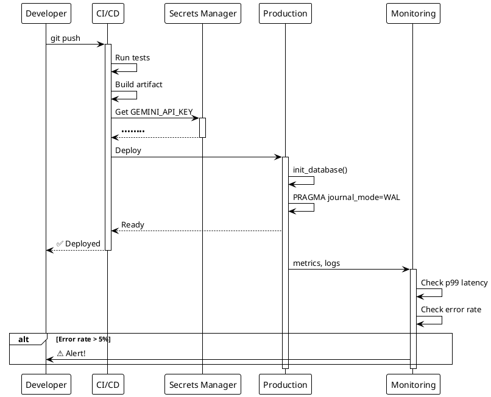

# 🚀 Phase 11.10: Guides (deployment)

> Production checklist и настройка продакшн окружения

---

## 🎯 Цель

Создать практические гайды для развёртывания Semantic Core в продакшне.

---

## 📊 Диаграмма: Production Deployment Flow



---

## 📋 Файлы для создания

### 1. guides/deployment/checklist.md

**Философия**: "Не скопировать, а понять что проверить"

**Содержание:**

#### Pre-deployment ✅

| Проверка | Зачем | Как проверить |
|----------|-------|---------------|
| API Key rotation | Безопасность | `semantic config show` |
| Embedding dimensions | Совместимость | `semantic db info` |
| Batch vs Sync | Экономия | Проверить конфиг |
| SQLite WAL mode | Concurrency | `PRAGMA journal_mode;` |

#### Runtime ✅

| Проверка | Зачем | Как проверить |
|----------|-------|---------------|
| Rate limiter настроен | Не hit 429 | Конфиг `rate_limit_rpm` |
| Retry policy | Resilience | Конфиг `max_retries` |
| Logging level | Debug vs Prod | `SC_LOG_LEVEL` |
| Secret redaction | Безопасность | Логи не содержат ключи |

#### Database ✅

| Проверка | Зачем | Как проверить |
|----------|-------|---------------|
| VACUUM регулярно | Размер | cron job |
| Backup strategy | DR | Скрипт бэкапа |
| Index stats | Performance | `ANALYZE` |

#### Monitoring ✅

| Что мониторить | Alert threshold |
|----------------|-----------------|
| API latency p99 | > 2s |
| Token usage daily | > budget |
| Queue backlog | > 1000 tasks |
| Error rate | > 5% |

**Frontmatter tags**: `[deployment, production, checklist, devops]`

---

### 2. guides/deployment/production.md

**Содержание:**

#### Конфигурация для продакшна

```toml
# semantic.toml - production preset

[embedding]
model = "gemini-embedding-001"
dimensions = 1536  # Баланс качество/размер
batch_mode = true  # Экономия 50%

[llm]
model = "gemini-2.5-flash"
temperature = 0.1  # Стабильные ответы

[resilience]
max_retries = 3
base_delay = 1.0
exponential_base = 2.0

[rate_limit]
rpm = 300  # 80% от лимита
burst = 10

[logging]
level = "INFO"
format = "json"
redact_secrets = true
```

#### Environment Variables

| Variable | Production value | Why |
|----------|------------------|-----|
| `SC_LOG_LEVEL` | `INFO` | Меньше шума |
| `SC_LOG_FORMAT` | `json` | Для ELK/Loki |
| `GEMINI_API_KEY` | secrets manager | Не .env! |

#### SQLite в продакшне

**WAL mode** — обязателен для concurrent reads:
```sql
PRAGMA journal_mode = WAL;
PRAGMA synchronous = NORMAL;
PRAGMA cache_size = -64000;  -- 64MB
```

**Диаграмма**: Sequence — Production deployment flow

**Frontmatter tags**: `[deployment, production, configuration, sqlite]`

---

### 3. guides/deployment/scaling.md (опционально)

**Содержание:**
- Горизонтальное масштабирование (read replicas)
- Шардинг по collections
- Queue workers: сколько инстансов
- Когда SQLite — не хватает → миграция на PostgreSQL/pgvector

**Frontmatter tags**: `[deployment, scaling, performance]`

---

## 📐 Шаблон deployment гайда

```markdown
---
title: "Production X"
description: "Как настроить X для продакшна"
tags: [deployment, production, x]
difficulty: intermediate
---

## Зачем это нужно 🎯

Краткое объяснение проблемы в продакшне.

## Checklist ✅

| Проверка | Статус | Примечание |
|----------|--------|------------|
| ... | ⬜ | ... |

## Конфигурация 📋

[Минимальный пример конфига]

## Мониторинг 📊

Что и как мониторить.

## Troubleshooting ⚠️

| Симптом | Причина | Решение |
|---------|---------|---------|
| ... | ... | ... |
```

---

## ✅ Критерии готовности

- [ ] 2-3 файла созданы
- [ ] Каждый ≤ 300 строк
- [ ] Таблицы checklist (copy-paste в Notion/Jira)
- [ ] Минимум конфигов, максимум объяснений
- [ ] Секция Monitoring с метриками

---

## 🔗 Зависимости

**Требует**: 11.4 (configuration guide)
**Блокирует**: Нет

---

## 💡 Ключевая идея

> "Checklist — это не tutorial. Это напоминание опытному разработчику,
> что нужно проверить перед деплоем."

Каждый пункт — вопрос "а ты это сделал?", а не инструкция как делать.
