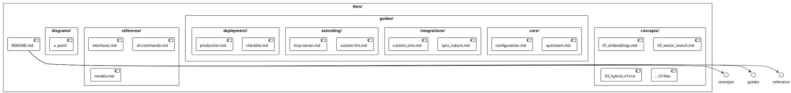

# 📂 Phase 11.1: Структура и README

> Создание файловой структуры и главной навигации

---

## 🎯 Цель

Создать скелет новой документации и точку входа для читателей.

---

## 📊 Диаграмма: Структура документации



---

## 📋 Задачи

### 1. Создать структуру папок

```bash
docs/
├── concepts/
├── guides/
│   └── extending/
├── reference/
├── diagrams/
└── internal/
    └── phase-reports/
```

### 2. Создать docs/README.md

**Структура файла:**

```markdown
---
title: "Semantic Core Documentation"
description: "Навигация по документации библиотеки"
---

# 📚 Semantic Core Documentation

> Краткое описание библиотеки (2-3 предложения)

## 🚀 Быстрый старт
[Ссылка на quickstart.md]

## 📖 Концепции
Таблица со всеми concepts/*.md

## 🛠️ Гайды
Таблица со всеми guides/*.md

## 📋 Справочник
Таблица со всеми reference/*.md

## 🎨 Диаграммы
Ссылка на diagrams/

## 🔧 Для контрибьюторов
Ссылка на internal/
```

---

## 📊 Формат таблиц навигации

```markdown
| Документ | Описание | Сложность |
|----------|----------|-----------|
| [Эмбеддинги](concepts/01_embeddings.md) | Векторные представления текста | 🟢 beginner |
| [Гибридный поиск](concepts/03_hybrid_rrf.md) | RRF слияние результатов | 🟡 intermediate |
```

---

## ✅ Критерии готовности

- [ ] Все папки созданы
- [ ] docs/README.md содержит навигацию
- [ ] Placeholder-ссылки на будущие файлы (можно <!-- TODO -->)
- [ ] Frontmatter в README.md

---

## 📁 Файлы для создания

1. `docs/README.md`
2. `docs/concepts/.gitkeep`
3. `docs/guides/.gitkeep`
4. `docs/guides/extending/.gitkeep`
5. `docs/reference/.gitkeep`
6. `docs/diagrams/.gitkeep`
7. `docs/internal/.gitkeep`
8. `docs/internal/phase-reports/.gitkeep`
