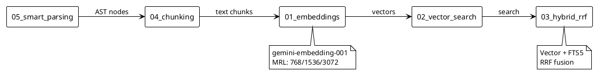

# 📖 Phase 11.2: Concepts (базовые 1-5)

> Фундаментальные концепции библиотеки

---

## 🎯 Цель

Написать 5 документов по базовым концепциям, переработав doc/architecture/01-05 и 15-18.

---

## 📊 Диаграмма: Связи между концепциями



---

## 📋 Файлы для создания

### 1. concepts/01_embeddings.md

**Источники**: doc/architecture/01_embeddings_basics.md, 02_gemini_api.md

**Содержание:**
- Что такое эмбеддинги (аналогия с координатами)
- MRL (Matryoshka Representation Learning) — выбор размерности
- task_type: RETRIEVAL_DOCUMENT vs RETRIEVAL_QUERY
- Нормализация векторов
- **Диаграмма**: Sequence — текст → API → вектор

**Актуальные модели**:
| Модель | Размерности (MRL) | Рекомендация |
|--------|-------------------|--------------|
| `gemini-embedding-001` | 768 / 1536 / 3072 | Production |
| `text-embedding-004` | 768 | Legacy |

**Frontmatter tags**: `[embeddings, gemini, vectors, mrl, basics]`

---

### 2. concepts/02_vector_search.md

**Источники**: doc/architecture/03_sqlite_vec.md, 04_search_types.md

**Содержание:**
- Косинусное расстояние (простое объяснение)
- sqlite-vec: как хранятся векторы (BLOB)
- Индексация и производительность
- Ограничения векторного поиска
- **Диаграмма**: Component — SQLite + vec extension

**Frontmatter tags**: `[vector-search, sqlite-vec, cosine, storage]`

---

### 3. concepts/03_hybrid_rrf.md

**Источники**: doc/architecture/04_search_types.md, 05_hybrid_search_rrf.md

**Содержание:**
- Проблема: vector не находит точные термины
- Проблема: FTS5 не понимает синонимы
- RRF формула (одна строка)
- Параметр k и его влияние
- Таблица сравнения: Vector vs FTS5 vs Hybrid
- **Диаграмма**: Activity — ветвление по mode

**Frontmatter tags**: `[hybrid-search, rrf, fts5, ranking]`

---

### 4. concepts/04_chunking.md

**Источники**: doc/architecture/08_chunking_strategy.md, 16_smart_splitting.md

**Содержание:**
- Зачем нужен chunking (лимит 2000 токенов)
- Overlap: зачем перекрытие
- Simple vs Smart splitting
- ChunkType enum: TEXT, CODE, IMAGE_REF, etc.
- Таблица параметров: chunk_size, overlap, min_size
- **Диаграмма**: Activity — алгоритм разбиения

**Frontmatter tags**: `[chunking, splitting, tokens, overlap]`

---

### 5. concepts/05_smart_parsing.md

**Источники**: doc/architecture/15_smart_parsing.md, 17_hierarchical_context.md

**Содержание:**
- AST-парсинг через markdown-it-py
- Иерархия заголовков (header stack)
- Breadcrumbs: "Title > H1 > H2 > Content"
- Изоляция code blocks
- Метаданные чанков (language, chunk_type)
- **Диаграмма**: Sequence — Parser → Splitter → Context

**Frontmatter tags**: `[parsing, markdown, ast, breadcrumbs, hierarchy]`

---

## 📐 Шаблон документа

```markdown
---
title: "Название концепции"
description: "Одно предложение"
tags: [tag1, tag2]
difficulty: beginner | intermediate
related: [другой_файл]
---

## Что это 📌

2-3 предложения определения.

## Зачем нужно 🎯

Проблема → Решение.

## Как работает 🔍

Объяснение + диаграмма.

## Параметры ⚙️

Таблица (если есть).

## Важные нюансы ⚠️

Gotchas.

## Связанные темы 🔗

- [Ссылка 1](file.md)
- [Ссылка 2](file.md)
```

---

## ✅ Критерии готовности

- [ ] 5 файлов созданы
- [ ] Каждый ≤ 400 строк
- [ ] Frontmatter заполнен
- [ ] Минимум 1 PlantUML диаграмма на файл
- [ ] ≤ 3 блоков кода
- [ ] Секция "Связанные темы"

---

## 🔗 Зависимости

**Требует**: 11.1 (структура папок)
**Блокирует**: 11.4 (guides ссылаются на concepts)
