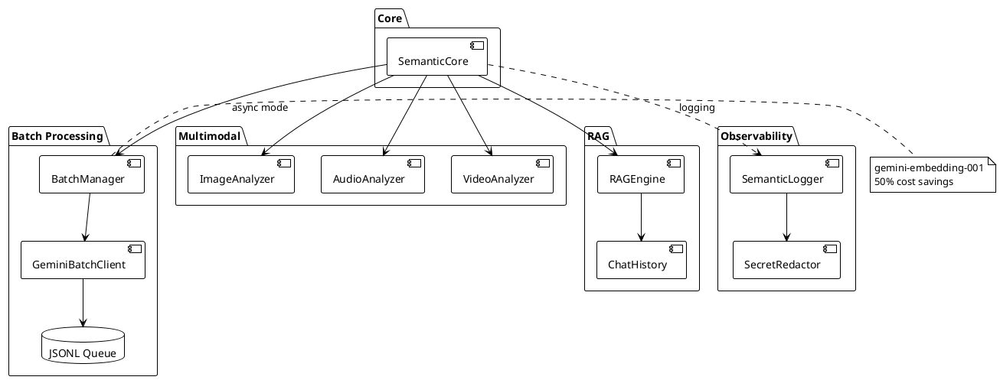

# 📖 Phase 11.3: Concepts (продвинутые 6-10)

> Продвинутые концепции: batch, multimodal, RAG, observability

---

## 🎯 Цель

Написать 5 документов по продвинутым концепциям, переработав doc/architecture/19-49.

---

## 📊 Диаграмма: Архитектура продвинутых компонентов



---

## 📋 Файлы для создания

### 6. concepts/06_batch_processing.md

**Источники**: doc/architecture/19-24 (Async Batching), doc/ideas/phase_10/

**Содержание:**
- Проблема: синхронный API блокирует UI
- Google Batch API: 50% экономия
- **Важно**: Batch API работает только с `gemini-embedding-001`
- Статусы чанков: PENDING → PROCESSING → READY/FAILED
- BatchManager: локальная очередь
- JSONL формат запросов
- **Диаграмма**: Sequence — ingest(mode=async) → flush → sync

**Frontmatter tags**: `[batch, async, cost-optimization, queue, gemini-embedding-001]`

---

### 7. concepts/07_multimodal.md

**Источники**: doc/architecture/25-34 (Multimodal Processing)

**Содержание:**
- Три анализатора: Image, Audio, Video
- Модель: `gemini-2.5-flash` (актуальная, multimodal)
- Structured JSON output
- Аудио: 32kbps оптимизация, 83 минуты в запросе
- Видео: кадры + аудио в одном запросе
- MediaTaskModel: персистентная очередь
- **Диаграмма**: Component — Media Pipeline

**Frontmatter tags**: `[multimodal, vision, audio, video, media, gemini-2.5-flash]`

---

### 8. concepts/08_rag_architecture.md

**Источники**: doc/architecture/44-49 (RAG Integration)

**Содержание:**
- RAG = Retrieval + Augmentation + Generation
- Два режима: chunks vs full_docs
- Модели для генерации:
  - `gemini-2.5-flash` — быстрая, thinking mode
  - `gemini-2.5-pro` — Deep Think, сложные задачи
  - `gemini-3.0-pro` — новейшая (2025)
- Prompt engineering: контекст + вопрос
- History management: token budget, compression
- Slash commands в чате
- **Диаграмма**: Sequence — question → search → context → LLM → answer

**Frontmatter tags**: `[rag, llm, chat, retrieval, generation, gemini-2.5]`

---

### 9. concepts/09_observability.md

**Источники**: doc/architecture/35-39 (Observability Layer)

**Содержание:**
- Dual-mode logging: Console (INFO+) + File (TRACE)
- TRACE уровень для AI-агентов
- Emoji семантика: мгновенная идентификация
- bind() для проброса контекста (batch_id, doc_id)
- Secret redaction: автоматическое маскирование
- **Диаграмма**: Component — Logger architecture

**Frontmatter tags**: `[logging, observability, trace, debugging]`

---

### 10. concepts/10_plugin_system.md

**Источники**: semantic_core/interfaces/*.py, архитектурный анализ

**Содержание:**
- Философия: Dependency Injection через интерфейсы
- 7 базовых интерфейсов (таблица)
- Как SemanticCore принимает зависимости
- Extension points: LLM, VectorStore, Embedder, Splitter
- Что НЕ pluggable (пока): Rate Limiter, Media Analyzers
- **Диаграмма**: Class — все интерфейсы и реализации

**Frontmatter tags**: `[plugins, interfaces, di, extensibility]`

---

## 📐 Шаблон документа

(Такой же как в 11.2)

---

## 🔍 Особенности продвинутых концепций

### Больше диаграмм
Каждый документ должен содержать 1-2 диаграммы, так как темы сложнее.

### Меньше кода
Избегать implementation details. Только концептуальный псевдокод.

### Ссылки на guides
Для практики направлять в guides/:
```markdown
**Практика**: [Настройка batch processing](../guides/batch-workflow.md)
```

---

## ✅ Критерии готовности

- [ ] 5 файлов созданы
- [ ] Каждый ≤ 400 строк
- [ ] Frontmatter заполнен
- [ ] 1-2 PlantUML диаграммы на файл
- [ ] Ссылки на guides для практики
- [ ] Секция "Связанные темы"

---

## 🔗 Зависимости

**Требует**: 11.1 (структура), 11.2 (базовые concepts)
**Блокирует**: 11.5 (extending guides)
