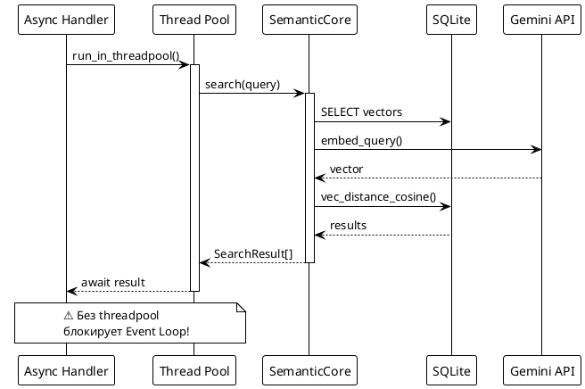

# 🔌 Phase 11.5: Guides (integrations)

> Паттерны интеграции: Sync Core + ORM адаптеры

---

## 🎯 Цель

Написать 4 документа, объясняющих **как интегрировать** библиотеку в любой стек, а не готовый код под конкретный фреймворк.

---

## 📊 Диаграмма: Sync Core в Async фреймворке



---

## 💡 Философия

> **"Даём кубики LEGO, а не готовый замок"**

- Не пишем код за пользователя Django/Flask
- Даём **рецепт** написания 50 строк адаптера
- Снимаем ответственность за баги в чужих проектах

---

## 📋 Файлы для создания

### 1. guides/core_concepts/sync_nature.md

**Критически важный документ!**

**Содержание:**

- **Semantic Core — синхронная (блокирующая) библиотека**
- Почему это так: SQLite + Gemini API calls
- Что это значит для async фреймворков
- Как не заблокировать Event Loop

**Ключевая таблица:**

| Фреймворк | Тип | Как использовать |
|-----------|-----|------------------|
| Django | Sync | Вызывать напрямую |
| Flask | Sync | Вызывать напрямую |
| FastAPI | Async | `run_in_threadpool()` |
| Litestar | Async | `run_in_executor()` |

**Пример псевдокода FastAPI:**

```python
from fastapi.concurrency import run_in_threadpool

@app.post("/search")
async def search(query: str):
    # ❌ ПЛОХО: блокирует Event Loop
    # results = core.search(query)
    
    # ✅ ХОРОШО: выполняется в thread pool
    results = await run_in_threadpool(core.search, query)
    return results
```

**Диаграмма**: Activity — Async Request → Thread Pool → Sync Core → Response

**Frontmatter tags**: `[integration, async, sync, fastapi, event-loop]`

---

### 2. guides/integrations/architecture.md

**Философия интеграции**

**Содержание:**

#### Dependency Injection

- Как создавать `SemanticCore` один раз при старте
- Singleton pattern vs State object
- Прокидывание в хендлеры

**Пример Django:**

```python
# settings.py
SEMANTIC_CORE = None

def get_semantic_core():
    global SEMANTIC_CORE
    if SEMANTIC_CORE is None:
        SEMANTIC_CORE = SemanticCore.from_config()
    return SEMANTIC_CORE
```

**Пример FastAPI:**

```python
from contextlib import asynccontextmanager

@asynccontextmanager
async def lifespan(app: FastAPI):
    app.state.core = SemanticCore.from_config()
    yield
    
@app.get("/search")
async def search(request: Request):
    core = request.app.state.core
    ...
```

#### Транзакции и соединения

- SQLite: один файл, thread-safe с WAL mode
- Не закрывайте соединение, которое нужно приложению
- `init_database()` вызывать один раз

**Диаграмма**: Component — Web App → Singleton Core → SQLite

**Frontmatter tags**: `[integration, di, singleton, architecture]`

---

### 3. guides/integrations/peewee.md

**Нативная поддержка (reference implementation)**

**Содержание:**

#### SemanticIndex дескриптор

- Как работает магия `Article.search`
- Автоиндексация при save/delete

**Пример "Было → Стало":**

```python
# БЫЛО: обычная Peewee модель
class Article(Model):
    title = TextField()
    content = TextField()

# СТАЛО: с семантическим поиском
class Article(Model):
    title = TextField()
    content = TextField()
    
    search = SemanticIndex(
        source_fields=['title', 'content'],
        store=vector_store,
        embedder=embedder,
    )
```

#### Транзакции

- Atomic операции
- Rollback при ошибках

#### init_database в веб-контексте

- Когда вызывать (startup event)
- Thread safety

**Диаграмма**: Sequence — save() → Patch → Embedder → VectorStore

**Frontmatter tags**: `[integration, peewee, orm, native]`

---

### 4. guides/integrations/custom_orm.md

**Blueprint: Как написать свой адаптер**

**Содержание:**

#### Что нужно реализовать

1. **Event hooks** — перехват save/delete
2. **Field mapping** — ORM fields → Document
3. **Query integration** — search results → ORM objects

#### Django Blueprint

```python
# Псевдокод адаптера (~50 строк)
from django.db.models.signals import post_save, post_delete

class DjangoSemanticAdapter:
    def __init__(self, model, core, fields):
        self.model = model
        self.core = core
        self.fields = fields
        
        # Подключаем сигналы
        post_save.connect(self._on_save, sender=model)
        post_delete.connect(self._on_delete, sender=model)
    
    def _on_save(self, sender, instance, **kwargs):
        doc = self._to_document(instance)
        self.core.ingest(doc)
    
    def _to_document(self, instance):
        content = ' '.join(
            getattr(instance, f) for f in self.fields
        )
        return Document(
            source_id=str(instance.pk),
            content=content,
            metadata={'model': self.model.__name__}
        )
```

**Таблица маппинга:**

| Django Field | Document Field |
|--------------|----------------|
| `models.TextField` | content |
| `models.CharField` | content |
| `models.DateTimeField` | metadata |
| `models.ForeignKey` | metadata (id) |

#### SQLAlchemy Blueprint

```python
# Псевдокод для SQLAlchemy 2.0+
from sqlalchemy import event

class SQLAlchemySemanticAdapter:
    def __init__(self, model, core, fields):
        self.model = model
        self.core = core
        self.fields = fields
        
        # События через event.listen
        event.listen(model, 'after_insert', self._on_insert)
        event.listen(model, 'after_update', self._on_update)
        event.listen(model, 'before_delete', self._on_delete)
    
    def _on_insert(self, mapper, connection, target):
        # Важно: НЕ использовать connection для SemanticCore
        # У нас свой SQLite файл
        doc = self._to_document(target)
        self.core.ingest(doc)
```

**⚠️ Session Management:**

```python
# SQLAlchemy использует свою сессию
# SemanticCore использует свой SQLite
# Они НЕ должны пересекаться!
```

**Диаграмма**: Class — BaseORMAdapter interface + Django/SQLAlchemy implementations

**Frontmatter tags**: `[integration, django, sqlalchemy, adapter, blueprint]`

---

## 📐 Шаблон документа

```markdown
---
title: "Название гайда"
description: "Что узнаете"
tags: [integration, ...]
difficulty: intermediate
---

## Ключевая идея 💡

Одно предложение о главном.

## Когда использовать 🎯

Таблица сценариев.

## Как это работает 🔍

Объяснение + диаграмма.

## Пример кода 📝

Псевдокод (НЕ готовый production код).

## Частые ошибки ⚠️

| Ошибка | Почему | Решение |
|--------|--------|---------|
| ... | ... | ... |

## Связанные темы 🔗

- [Ссылка](file.md)
```

---

## ✅ Критерии готовности

- [ ] 4 файла созданы
- [ ] sync_nature.md объясняет Event Loop проблему
- [ ] Псевдокод, а не готовый production код
- [ ] Диаграммы для каждого паттерна
- [ ] Таблицы маппинга полей
- [ ] Секция "Частые ошибки"

---

## 🔗 Зависимости

**Требует**: 11.1 (структура), 11.3 (concepts/10_plugin_system.md)
**Блокирует**: Нет

---

## ⚠️ Важно: Что НЕ писать

- ❌ Готовый pip-installable пакет `semantic-core-django`
- ❌ Полный рабочий код с тестами
- ❌ Инструкции по настройке Django/Flask

Мы даём **рецепт** и **blueprints**, а не готовое решение.
