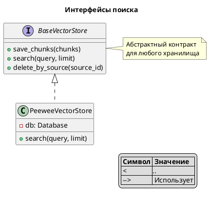
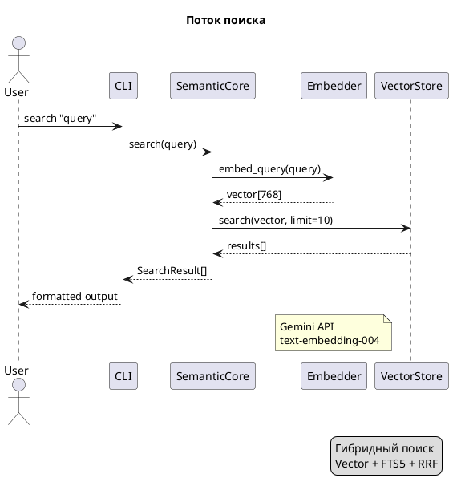
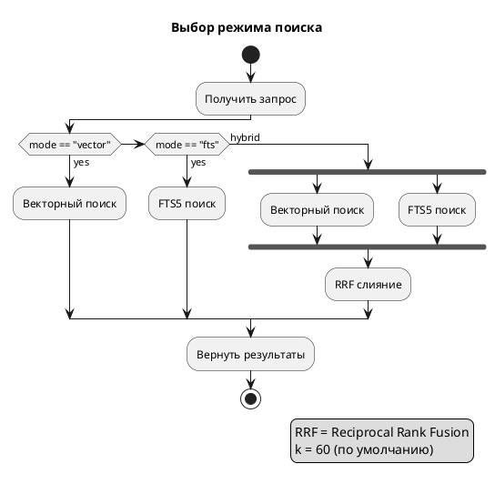
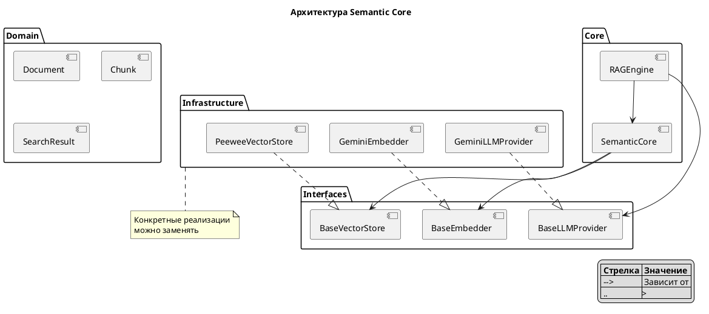

# 📝 Стайл-гайд документации Phase 11

> Краткие правила оформления для всех документов в docs/

---

## 📋 Frontmatter (обязателен)

```yaml
---
title: "Название документа"
description: "Одно предложение о чём документ"
tags: [tag1, tag2, tag3]
difficulty: beginner | intermediate | advanced
interfaces: [Interface1, Interface2]  # если применимо
related: [file1, file2]               # связанные документы
---
```

---

## 📐 Заголовки

### Правила
- **H1** — только title из frontmatter (не дублировать)
- **H2** — основные секции + эмодзи в конце
- **H3** — подсекции + эмодзи в конце
- **H4+** — избегать (слишком глубоко)

### Пример
```markdown
## Как это работает 🔍

### Шаг 1: Векторизация 📊

### Шаг 2: Поиск 🎯
```

### Стандартные секции

| Секция | Эмодзи | Когда использовать |
|--------|--------|-------------------|
| Что это | 📌 | Определение концепции |
| Зачем нужно | 🎯 | Мотивация, проблема→решение |
| Как работает | 🔍 | Механика, алгоритм |
| Prerequisites | 📋 | Что нужно перед началом |
| Пошаговая инструкция | 🛠️ | How-to гайды |
| Параметры/Опции | ⚙️ | Конфигурация |
| Примеры | 💡 | Код, use cases |
| Важные нюансы | ⚠️ | Gotchas, edge cases |
| Частые ошибки | ❌ | Troubleshooting |
| Сравнение | 📊 | Таблица альтернатив |
| Связанные темы | 🔗 | Ссылки на другие доки |

---

## 📊 Таблицы вместо списков

### ❌ Плохо: Длинный список
```markdown
- `chunk_size` — размер чанка в токенах
- `overlap` — перекрытие между чанками
- `min_size` — минимальный размер чанка
- `max_size` — максимальный размер чанка
```

### ✅ Хорошо: Таблица
```markdown
| Параметр | Тип | По умолчанию | Описание |
|----------|-----|--------------|----------|
| chunk_size | int | 1000 | Размер чанка в токенах |
| overlap | int | 200 | Перекрытие между чанками |
| min_size | int | 100 | Минимальный размер |
| max_size | int | 2000 | Максимальный размер |
```

---

## 🎨 PlantUML диаграммы

### Правила
1. **Без стилизации** — никаких skinparam, theme
2. **Заголовок обязателен** — `title`
3. **Легенда** — `legend` для пояснений
4. **Notes** — для важных комментариев

### Типы диаграмм

| Тип | Когда использовать | Ключевые слова |
|-----|-------------------|----------------|
| **Class** | Интерфейсы, наследование | `class`, `interface`, `extends` |
| **Component** | Архитектура модулей | `component`, `package`, `-->` |
| **Sequence** | Поток данных, API вызовы | `->`, `-->`, `activate` |
| **Activity** | Ветвление, workflow | `if`, `else`, `fork`, `end fork` |

### Шаблон: Class diagram


### Шаблон: Sequence diagram


### Шаблон: Activity diagram


### Шаблон: Component diagram


---

## 📏 Размеры

| Метрика | Лимит |
|---------|-------|
| Строк в файле | ≤ 400 |
| Блоков кода | ≤ 3 на файл |
| Строк в блоке кода | ≤ 15 |
| Вложенность папок | ≤ 2 уровня |

---

## 🔗 Ссылки

### Внутренние
```markdown
[Гибридный поиск](../concepts/03_hybrid_rrf.md)
[CLI команды](../reference/cli-commands.md#search)
```

### Секция в конце файла
```markdown
---

## Связанные темы 🔗

- [Векторный поиск](02_vector_search.md) — основа hybrid search
- [Настройка RRF](../reference/configuration-options.md#search) — параметр rrf_k
- [CLI поиск](../guides/cli-usage.md#search) — практическое использование
```

---

## ✅ Чеклист перед коммитом

- [ ] Frontmatter заполнен полностью
- [ ] Заголовки H2/H3 с эмодзи
- [ ] Таблицы вместо длинных списков
- [ ] PlantUML без стилизации, с title и legend
- [ ] ≤ 400 строк
- [ ] ≤ 3 блоков кода
- [ ] Секция "Связанные темы" в конце
- [ ] Все ссылки валидны
