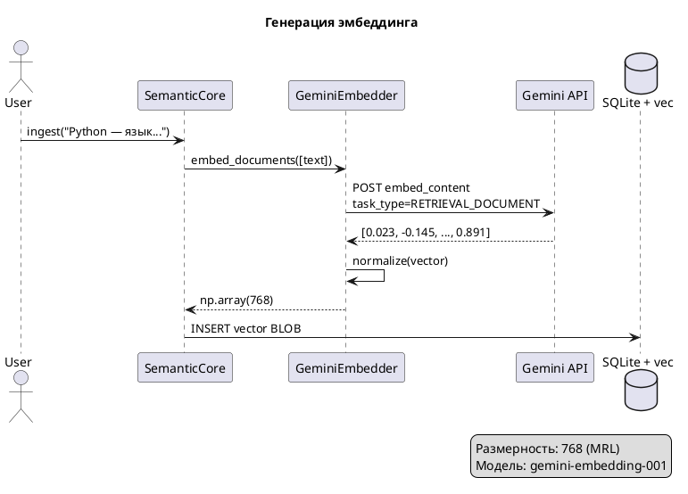

## Что это 📌

**Эмбеддинг** — числовое представление текста в виде вектора. Каждый текст превращается в точку в многомерном пространстве, где похожие по смыслу тексты находятся близко друг к другу.

| Термин | Определение |
|--------|-------------|
| Вектор | Массив чисел фиксированной длины (например, 768 или 3072) |
| Размерность | Количество чисел в векторе |
| Косинусное расстояние | Мера похожести двух векторов (0 = идентичны, 2 = противоположны) |

---

## Зачем нужно 🎯

**Проблема**: Обычный поиск по ключевым словам не понимает смысл.

| Запрос | Классический поиск | Семантический поиск |
|--------|-------------------|---------------------|
| "как написать цикл" | ❌ Не найдёт "for loop" | ✅ Найдёт все варианты |
| "домашнее животное" | ❌ Не найдёт "кот", "собака" | ✅ Найдёт по смыслу |
| "рецепт борща" | ❌ Только точное совпадение | ✅ Найдёт "украинский суп" |

**Решение**: Преобразуем текст в вектор → сравниваем векторы → находим похожие по смыслу.

---

## Как работает 🔍



---

## Модели эмбеддингов ⚙️

| Модель | Размерности (MRL) | Batch API | Рекомендация |
|--------|-------------------|-----------|--------------|
| `gemini-embedding-001` | 768 / 1536 / 3072 | ✅ | **Production** |
| `text-embedding-004` | 768 | ❌ | Legacy, бесплатная |

### MRL (Matryoshka Representation Learning)

Модель `gemini-embedding-001` поддерживает **динамическую размерность**:

| Размерность | Качество | Размер хранения | Когда использовать |
|-------------|----------|-----------------|-------------------|
| 3072 | 100% | 12 KB/вектор | Максимальное качество |
| 1536 | ~99% | 6 KB/вектор | Баланс |
| **768** | ~98% | 3 KB/вектор | **Default**, экономия |

---

## Task Types: асимметричный поиск ⚙️

Gemini использует разные режимы для документов и запросов:

| Task Type | Когда использовать | Оптимизация |
|-----------|-------------------|-------------|
| `RETRIEVAL_DOCUMENT` | Индексация контента | Длинные тексты |
| `RETRIEVAL_QUERY` | Поисковые запросы | Короткие вопросы |

```python
# Semantic Core делает это автоматически:
embedder.embed_documents(texts)  # → RETRIEVAL_DOCUMENT
embedder.embed_query(query)      # → RETRIEVAL_QUERY
```

---

## Ключевые свойства 💡

### 1. Близость = похожесть

```
"Python — язык"  ←→  "Питон для разработки"   = 0.12 (близко)
"Python — язык"  ←→  "Борщ — украинский суп"  = 0.89 (далеко)
```

### 2. Язык не важен (multilingual)

```
"цикл в программировании" ≈ "loop in programming"
```

### 3. Контекст учитывается

```
"банк с деньгами" ≠ "банк в парке"
```

---

## Важные нюансы ⚠️

| Нюанс | Описание |
|-------|----------|
| Нормализация | Векторы нормализуются (длина = 1) для косинусного расстояния |
| Лимит токенов | ~2000 токенов на запрос → используй chunking |
| Не обратимы | Из вектора нельзя восстановить текст |
| Модели несовместимы | Нельзя смешивать векторы от разных моделей в одной БД |

---

## Интерфейс в коде 📋

```python
class BaseEmbedder(ABC):
    """Контракт для всех embedder-провайдеров."""
    
    @abstractmethod
    def embed_documents(self, texts: list[str]) -> list[np.ndarray]:
        """Векторизация списка документов."""
        
    @abstractmethod  
    def embed_query(self, text: str) -> np.ndarray:
        """Векторизация поискового запроса."""
```

**Реализации**: `GeminiEmbedder` (production), можно добавить OpenAI, Cohere, local.

---

## Связанные темы 🔗

- [Векторный поиск](02_vector_search.md) — как искать по векторам в SQLite
- [Гибридный поиск RRF](03_hybrid_rrf.md) — объединение с полнотекстовым поиском
- [Chunking](04_chunking.md) — разбиение длинных документов
- [Model Configuration](../guides/core/model-configuration.md) — выбор модели и размерности
