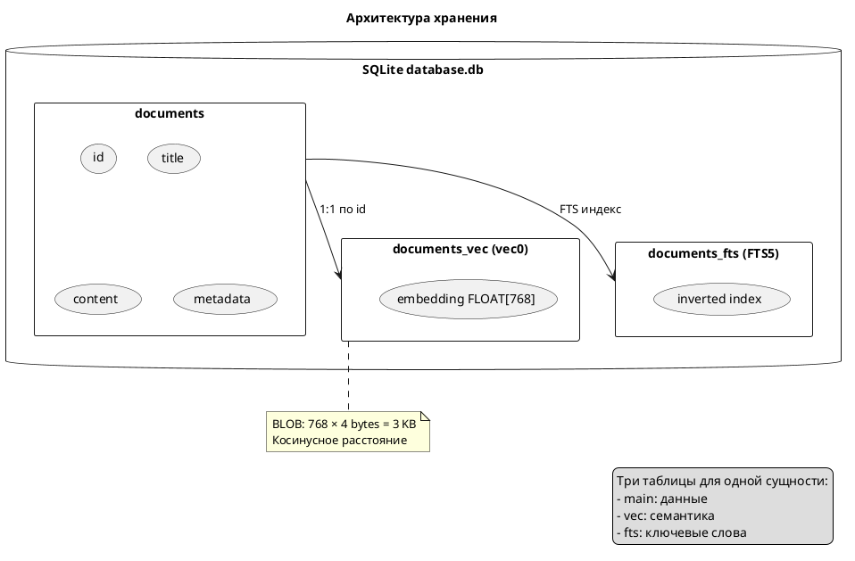

## Что это 📌

**Векторный поиск** — поиск похожих документов по расстоянию между их векторами. Чем меньше расстояние — тем больше семантическое сходство.

**sqlite-vec** — C-расширение для SQLite, добавляющее:

- Виртуальные таблицы `vec0` для хранения векторов
- Функции расстояния (`vec_distance_cosine`, `vec_distance_l2`)
- BLOB-сериализацию float32 массивов

---

## Зачем нужно 🎯

| Проблема | Решение |
|----------|---------|
| SQLite не умеет хранить векторы | `vec0` виртуальная таблица |
| Нет метрик расстояния | `vec_distance_cosine()` |
| Нужна внешняя векторная БД (Pinecone, Qdrant) | Всё в одном файле `.db` |

**Результат**: Zero-dependency векторный поиск. Один SQLite файл = данные + векторы + FTS индекс.

---

## Как работает 🔍



---

## Метрики расстояния ⚙️

| Функция | Описание | Когда использовать |
|---------|----------|-------------------|
| `vec_distance_cosine` | Косинусное расстояние | **Текстовые эмбеддинги** |
| `vec_distance_l2` | Евклидово расстояние | Изображения, координаты |
| `vec_distance_l1` | Manhattan distance | Разреженные векторы |

**Semantic Core использует `cosine`** — стандарт для text embeddings.

### Интерпретация cosine distance

| Значение | Смысл |
|----------|-------|
| 0.0 | Идентичные тексты |
| 0.0 - 0.3 | Очень похожие |
| 0.3 - 0.6 | Связанные темы |
| 0.6 - 1.0 | Разные темы |
| 1.0 | Ортогональны (не связаны) |

---

## SQL-запрос поиска 💡

```sql
SELECT 
    main.id,
    main.title,
    vec_distance_cosine(vec.embedding, ?) as distance
FROM documents main
INNER JOIN documents_vec vec ON main.id = vec.id
ORDER BY distance ASC
LIMIT 10;
```

**Параметр `?`** — BLOB вектора запроса (результат `embed_query()`).

---

## Сериализация векторов ⚙️

### Python → SQLite BLOB

```python
import numpy as np

vector = np.array([0.1, 0.2, ...], dtype=np.float32)
blob = vector.tobytes()  # → bytes для INSERT
```

### SQLite BLOB → Python

```python
blob = cursor.fetchone()[0]
vector = np.frombuffer(blob, dtype=np.float32)
```

**Важно**: Только `float32`! Не `float64`.

---

## Размер хранения 📊

| Размерность | Байт на вектор | 10K документов |
|-------------|----------------|----------------|
| 768 | 3 KB | 30 MB |
| 1536 | 6 KB | 60 MB |
| 3072 | 12 KB | 120 MB |

**Компактно** для локальных баз!

---

## Производительность ⚙️

### Линейный поиск (без индекса)

| Документов | Время поиска |
|------------|--------------|
| 1,000 | ~10 ms |
| 10,000 | ~50 ms |
| 100,000 | ~300 ms |

**sqlite-vec не имеет HNSW индекса** (в отличие от pgvector). Для >100K документов рассмотри альтернативы.

### Когда sqlite-vec достаточно

| Размер базы | Рекомендация |
|-------------|--------------|
| < 10K | ✅ Идеально |
| 10K - 100K | ✅ Приемлемо |
| > 100K | ⚠️ Рассмотри pgvector |

---

## Важные нюансы ⚠️

| Нюанс | Описание |
|-------|----------|
| Фиксированная размерность | Все векторы в таблице должны быть одной длины |
| Загрузка расширения | `sqlite_vec.load(conn)` при каждом подключении |
| WAL mode | Рекомендуется для concurrent reads |
| Нет partial index | Нельзя индексировать подмножество векторов |

---

## Интеграция в Semantic Core 📋

Semantic Core абстрагирует работу с sqlite-vec через `BaseVectorStore`:

```python
class BaseVectorStore(ABC):
    @abstractmethod
    def search(
        self,
        query_vector: Optional[Any] = None,
        query_text: Optional[str] = None,
        filters: Optional[dict] = None,
        limit: int = 10,
        mode: str = "hybrid",  # vector | fts | hybrid
        k: int = 60,  # RRF параметр
    ) -> list[SearchResult]: ...
```

**Реализация**: `PeeweeVectorStore` использует `vec_distance_cosine` внутри.

---

## Связанные темы 🔗

- [Эмбеддинги](01_embeddings.md) — как генерируются векторы
- [Гибридный поиск RRF](03_hybrid_rrf.md) — объединение с FTS5
- [Interfaces Reference](../reference/interfaces.md) — методы BaseVectorStore
