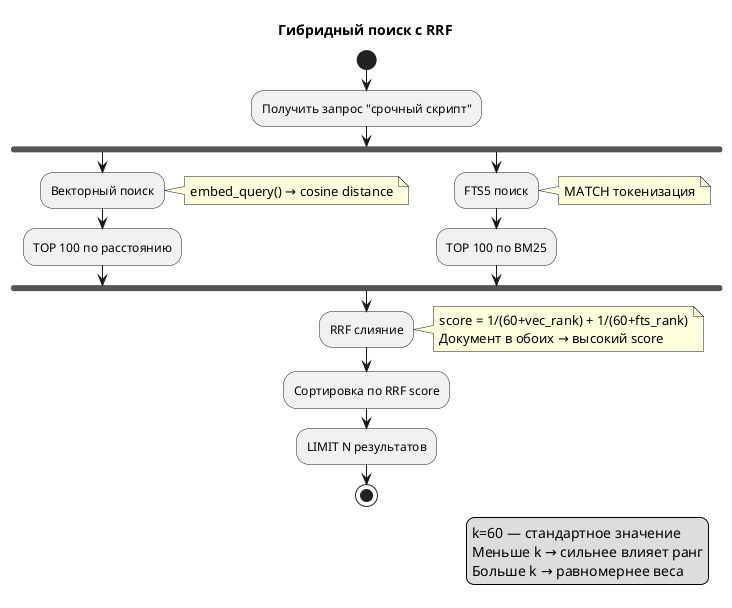

## Что это 📌

**Гибридный поиск** — объединение векторного (семантического) и полнотекстового (FTS5) поиска для получения лучших результатов.

**RRF (Reciprocal Rank Fusion)** — алгоритм слияния результатов из разных источников по формуле:

```
RRF_score(doc) = Σ 1 / (k + rank_i)
```

| Параметр | Значение | Описание |
|----------|----------|----------|
| k | 60 | Константа сглаживания (default) |
| rank_i | 1, 2, 3... | Позиция документа в i-м источнике |

---

## Зачем нужно 🎯

| Проблема | Vector | FTS5 | Hybrid |
|----------|--------|------|--------|
| Синонимы ("цикл" → "loop") | ✅ | ❌ | ✅ |
| Точные термины ("OAuth2") | ❌ | ✅ | ✅ |
| Редкие слова | ⚠️ | ✅ | ✅ |
| Опечатки | ⚠️ | ❌ | ⚠️ |

**Результат**: Документы, найденные **обоими** методами, поднимаются наверх.

---

## Как работает 🔍



---

## Пример расчёта RRF 📊

**Запрос**: "срочный скрипт"

### Результаты поисков

| Документ | Vector rank | FTS rank |
|----------|-------------|----------|
| Скрипт обработки | 2 | 1 |
| Улучшение алгоритма | 1 | 2 |
| Циклы в Python | 3 | — |

### RRF Score (k=60)

| Документ | Расчёт | Score |
|----------|--------|-------|
| Скрипт обработки | 1/(60+2) + 1/(60+1) = 0.0161 + 0.0164 | **0.0325** |
| Улучшение алгоритма | 1/(60+1) + 1/(60+2) = 0.0164 + 0.0161 | 0.0325 |
| Циклы в Python | 1/(60+3) + 0 = 0.0159 | 0.0159 |

**Итог**: "Скрипт обработки" — топ в обоих → первое место.

---

## Режимы поиска в Semantic Core ⚙️

```python
# Только векторный поиск
results = core.search(query, mode="vector")

# Только полнотекстовый
results = core.search(query, mode="fts")

# Гибридный (default)
results = core.search(query, mode="hybrid", k=60)
```

| Mode | Когда использовать |
|------|-------------------|
| `vector` | Семантически размытые запросы ("что-то про машинное обучение") |
| `fts` | Точные термины, имена, коды ("RFC 7231", "OAuth2") |
| `hybrid` | **Универсальный** — для большинства случаев |

---

## SQL-структура запроса 💡

```sql
WITH vector_results AS (
    SELECT id, ROW_NUMBER() OVER (
        ORDER BY vec_distance_cosine(embedding, ?)
    ) as rank
    FROM chunks_vec
    LIMIT 100
),
fts_results AS (
    SELECT rowid as id, ROW_NUMBER() OVER (
        ORDER BY rank
    ) as rank  
    FROM chunks_fts
    WHERE chunks_fts MATCH ?
    LIMIT 100
),
rrf_scores AS (
    SELECT 
        COALESCE(v.id, f.id) as id,
        COALESCE(1.0/(60 + v.rank), 0) + 
        COALESCE(1.0/(60 + f.rank), 0) as score
    FROM vector_results v
    FULL OUTER JOIN fts_results f ON v.id = f.id
)
SELECT * FROM rrf_scores ORDER BY score DESC LIMIT 10;
```

---

## Фильтрация по метаданным ⚙️

```python
# Поиск только в категории "Python"
results = core.search(
    query="циклы",
    mode="hybrid",
    filters={"category": "Python"}
)
```

Фильтры применяются **до** RRF слияния для производительности.

---

## Производительность 📊

| Метод | 10K документов |
|-------|----------------|
| Vector only | ~50 ms |
| FTS only | ~5 ms |
| Hybrid (RRF) | ~60 ms |

**Накладные расходы RRF минимальны** — основное время на векторный поиск.

---

## Настройка параметра k ⚙️

| k | Эффект |
|---|--------|
| 10 | Сильнее различает TOP-3 от остальных |
| **60** | **Стандарт** — сбалансировано |
| 100 | Более плоское распределение весов |

**Рекомендация**: Оставить `k=60` если нет специфических требований.

---

## Важные нюансы ⚠️

| Нюанс | Описание |
|-------|----------|
| FULL OUTER JOIN | SQLite не поддерживает → эмуляция через UNION |
| TOP 100 в CTE | Ограничивает кандидатов для производительности |
| Нормализация запроса | FTS требует токенизацию для MATCH |
| Нет документа в FTS | Получает score только от vector (и наоборот) |

---

## Связанные темы 🔗

- [Эмбеддинги](01_embeddings.md) — как генерируются векторы
- [Векторный поиск](02_vector_search.md) — sqlite-vec и cosine distance
- [Chunking](04_chunking.md) — почему ищем по чанкам, а не документам
- [CLI Usage](../guides/core/cli-usage.md) — `semantic search --mode hybrid`
