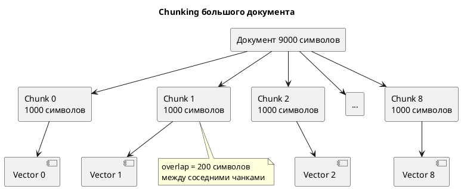

## Что это 📌

**Chunking** — разбиение больших документов на маленькие фрагменты (чанки) для векторизации. Каждый чанк получает свой вектор и индексируется отдельно.

| Термин | Описание |
|--------|----------|
| Chunk | Фрагмент документа (~500-2000 символов) |
| Overlap | Перекрытие между соседними чанками |
| ChunkType | Тип контента (TEXT, CODE, IMAGE_REF...) |

---

## Зачем нужно 🎯

**Проблема**: Gemini embedding API ограничен ~2000 токенов на запрос.

| Язык | ~Токенов | ~Символов |
|------|----------|-----------|
| Английский | 2000 | 6000-8000 |
| Русский | 2000 | 4000-5000 |
| Код Python | 2000 | 5000-7000 |

**Решение**: Режем документ → векторизуем каждый чанк → ищем по чанкам.



---

## ChunkType: типы контента ⚙️

```python
class ChunkType(str, Enum):
    TEXT = "text"       # Обычный текст
    CODE = "code"       # Блок кода
    TABLE = "table"     # Таблица
    IMAGE_REF = "image_ref"   # Ссылка на изображение
    AUDIO_REF = "audio_ref"   # Ссылка на аудио
    VIDEO_REF = "video_ref"   # Ссылка на видео
```

| ChunkType | Когда создаётся | Metadata |
|-----------|-----------------|----------|
| TEXT | Обычные параграфы | headers (breadcrumbs) |
| CODE | \`\`\`python...\`\`\` | language, headers |
| TABLE | Markdown таблицы | headers |
| IMAGE_REF | `` | src, alt, headers |
| AUDIO_REF | `[audio](file.mp3)` | src, headers |
| VIDEO_REF | `[video](file.mp4)` | src, headers |

---

## Два сплиттера 🔍

### SimpleSplitter (legacy)

Режет по количеству символов с поиском переноса строки:

```python
SimpleSplitter(
    chunk_size=1000,   # Целевой размер
    overlap=200,       # Перекрытие
    threshold=100      # Окно поиска \n
)
```

**Недостатки**:
- ❌ Может разрезать код посередине
- ❌ Не понимает структуру Markdown
- ❌ Теряет иерархию заголовков

### SmartSplitter (recommended)

Работает с AST через `MarkdownNodeParser`:

```python
SmartSplitter(
    parser=MarkdownNodeParser(),
    chunk_size=1000,
    code_chunk_size=2000,
    preserve_code=True,  # Не резать код
)
```

**Преимущества**:
- ✅ Изолирует блоки кода
- ✅ Сохраняет breadcrumbs (заголовки)
- ✅ Группирует мелкие параграфы
- ✅ Типизирует чанки (TEXT/CODE/IMAGE_REF)

---

## Overlap: зачем перекрытие 💡

**Без overlap**: теряем контекст на границах.

```
Chunk 1: "Python — это язык программир"
Chunk 2: "ания. Он используется для..."
         ❌ Потеряли связь!
```

**С overlap=200**:

```
Chunk 1: "Python — это язык программирования. Он"
Chunk 2:                  "ирования. Он используется для..."
                          ↑ перекрытие
         ✅ Контекст сохранён!
```

**Правило**: `overlap ≈ 20% от chunk_size`

---

## Настройки сплиттера ⚙️

| Параметр | Default | Когда менять |
|----------|---------|--------------|
| chunk_size | 1000 | Больше для длинных статей |
| overlap | 200 | Меньше для кода (меньше дублей) |
| code_chunk_size | 2000 | Длинные функции |
| preserve_code | True | False если код не важен |

### Пресеты

```python
# Короткие заметки
SmartSplitter(parser, chunk_size=500, overlap=100)

# Статьи (default)
SmartSplitter(parser, chunk_size=1000, overlap=200)

# Техническая документация
SmartSplitter(parser, chunk_size=1500, overlap=300)
```

---

## Metadata чанков 📊

Каждый чанк содержит метаданные:

```python
@dataclass
class Chunk:
    content: str           # Текст
    chunk_index: int       # 0, 1, 2...
    chunk_type: ChunkType  # TEXT/CODE/...
    language: str | None   # "python", "sql"...
    embedding: np.ndarray  # Вектор (заполняется позже)
    parent_doc_id: int     # ID документа
    metadata: dict         # headers, start_line, end_line
```

**Пример metadata**:

```json
{
  "headers": ["Installation", "Requirements"],
  "start_line": 15,
  "end_line": 42
}
```

---

## Интерфейс BaseSplitter 📋

```python
class BaseSplitter(ABC):
    @abstractmethod
    def split(self, document: Document) -> list[Chunk]:
        """Разбивает документ на чанки БЕЗ векторов."""
```

**Реализации**: `SimpleSplitter`, `SmartSplitter`

---

## Важные нюансы ⚠️

| Нюанс | Описание |
|-------|----------|
| Чанки без векторов | `split()` возвращает чанки с `embedding=None` |
| Векторизация отдельно | `embedder.embed_documents()` заполняет векторы |
| Не дублировать | overlap создаёт дубли текста → больше токенов |
| Metadata наследуется | headers из парсера → в чанк |

---

## Связанные темы 🔗

- [Эмбеддинги](01_embeddings.md) — как чанки превращаются в векторы
- [Smart Parsing](05_smart_parsing.md) — AST-парсинг Markdown
- [Гибридный поиск](03_hybrid_rrf.md) — поиск по чанкам
- [Chunk Types Reference](../reference/chunk-types.md) — полный справочник типов
