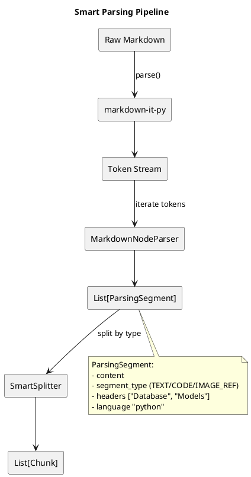

## Что это 📌

**Smart Parsing** — структурный анализ Markdown через AST (Abstract Syntax Tree) вместо простого разбиения по символам.

| Компонент | Описание |
|-----------|----------|
| `markdown-it-py` | Python-порт markdown-it, генерирует token stream |
| `MarkdownNodeParser` | Парсер, преобразующий tokens в `ParsingSegment` |
| `HierarchicalContextStrategy` | Обогащает чанки breadcrumbs для embeddings |

---

## Зачем нужно 🎯

**Проблема**: "Плоские" чанки теряют контекст.

| До (SimpleSplitter) | После (SmartSplitter) |
|---------------------|----------------------|
| Заголовки разрываются | Структура сохраняется |
| Код смешивается с текстом | Код изолирован |
| Нет иерархии | Breadcrumbs: "Database > Models > User" |
| Поиск неточный | Поиск понимает контекст |

---

## Как работает 🔍



---

## ParsingSegment: промежуточная структура ⚙️

```python
@dataclass
class ParsingSegment:
    content: str              # Текст сегмента
    segment_type: ChunkType   # TEXT/CODE/TABLE/IMAGE_REF
    language: str | None      # Язык для CODE
    headers: list[str]        # Иерархия заголовков
    start_line: int | None    # Начало в исходнике
    end_line: int | None      # Конец в исходнике
    metadata: dict            # Дополнительные данные
```

**Разделение ответственности** (SOLID):
- Parser → **структура** (что это: код, текст, изображение)
- Splitter → **размер** (когда резать на чанки)

---

## Token Types в markdown-it-py 📊

| Token | Что парсим | Результат |
|-------|-----------|-----------|
| `heading_open` | `# Title` | Push to header stack |
| `heading_close` | | Pop when level changes |
| `fence` | \`\`\`python | CODE segment |
| `paragraph_open/close` | Text | TEXT segment |
| `image` | `` | IMAGE_REF segment |
| `table_open/close` | `\| a \| b \|` | TABLE segment |

---

## Header Stack: отслеживание иерархии 💡

### Алгоритм

```python
header_stack = []

# Встретили H1 "Database"
header_stack = ["Database"]

# Встретили H2 "Models" 
header_stack = ["Database", "Models"]

# Встретили H3 "User"
header_stack = ["Database", "Models", "User"]

# Встретили H2 "Controllers" → H3 вытесняется
header_stack = ["Database", "Controllers"]
```

### Пример

```markdown
# Database          ← stack: ["Database"]
## Models           ← stack: ["Database", "Models"]
### User            ← stack: ["Database", "Models", "User"]
Fields: id, email   ← segment.headers = ["Database", "Models", "User"]
## Controllers      ← stack: ["Database", "Controllers"]
```

---

## HierarchicalContextStrategy 🔍

### Проблема

Embedder получает только `content` чанка:

```
"The User model represents authenticated users."
```

Вектор **не знает**, что это про Database > Models > User.

### Решение

Обогащаем текст breadcrumbs перед векторизацией:

```
Document: API Documentation
Section: Database > Models > User
Content:
The User model represents authenticated users.
```

### Интерфейс

```python
class BaseContextStrategy(ABC):
    @abstractmethod
    def form_vector_text(
        self, 
        chunk: Chunk, 
        document: Document
    ) -> str:
        """Формирует текст для embedder с контекстом."""
```

**Реализации**:
- `NoContextStrategy` — только content
- `BasicContextStrategy` — title + content
- `HierarchicalContextStrategy` — breadcrumbs + content

---

## Интерфейс DocumentParser 📋

```python
class DocumentParser(Protocol):
    def parse(self, content: str) -> Iterator[ParsingSegment]:
        """Парсит документ и возвращает поток сегментов."""
```

**Реализация**: `MarkdownNodeParser`

---

## Важные нюансы ⚠️

| Нюанс | Описание |
|-------|----------|
| Зависимость | `markdown-it-py >= 3.0.0` |
| Streaming | `parse()` возвращает Iterator, не List |
| Nested lists | Объединяются в один TEXT segment |
| HTML в Markdown | Пропускается (только Markdown) |
| Frontmatter | Извлекается отдельно в Document.metadata |

---

## Пример работы 💡

### Input

```markdown
# Installation
## Requirements
- Python 3.11+
- SQLite 3.35+

```python
pip install semantic-core
```
```

### Output (ParsingSegments)

| # | Type | Headers | Content |
|---|------|---------|---------|
| 1 | TEXT | [Installation, Requirements] | "- Python 3.11+\n- SQLite 3.35+" |
| 2 | CODE | [Installation, Requirements] | "pip install..." (lang=python) |

---

## Связанные темы 🔗

- [Chunking](04_chunking.md) — как сегменты превращаются в чанки
- [Гибридный поиск](03_hybrid_rrf.md) — поиск по типизированным чанкам
- [Plugin System](10_plugin_system.md) — интерфейсы DocumentParser, BaseContextStrategy
