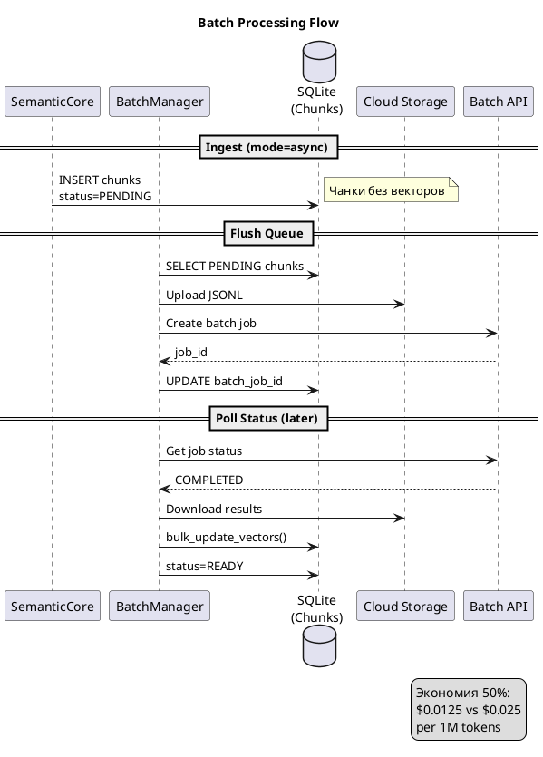

## Что это 📌

**Batch Processing** — отложенная обработка эмбеддингов через Google Batch API. Вместо мгновенного ответа задание помещается в очередь и обрабатывается за 10-30 минут.

| Режим | Цена | Latency | Use case |
|-------|------|---------|----------|
| Sync (embed_content) | $0.025/1M tokens | ~200ms | Интерактивный поиск |
| **Batch API** | $0.0125/1M tokens | 10-30 min | Массовая индексация |

**Экономия**: 50% стоимости!

---

## Зачем нужно 🎯

**Сценарий**: База знаний 10,000 документов (avg 500 токенов).

| Режим | Стоимость | В год |
|-------|-----------|-------|
| Sync API | $125/индексация | $1,500 |
| **Batch API** | $62.50/индексация | $750 |

**Важно**: Batch API работает только с `gemini-embedding-001`, не с `text-embedding-004`.

---

## Как работает 🔍



---

## Статусы чанков ⚙️

| Status | Описание |
|--------|----------|
| `PENDING` | Ожидает отправки в batch |
| `PROCESSING` | Отправлен, ждём результат |
| `READY` | Вектор получен и сохранён |
| `FAILED` | Ошибка обработки |

---

## BatchManager: оркестратор 📊

```python
class BatchManager:
    def flush_queue(
        self, 
        min_size: int = 100,
        force: bool = False
    ) -> str | None:
        """Отправляет накопленные PENDING чанки в Batch API."""
    
    def sync_status(self) -> int:
        """Проверяет завершённые задания, обновляет векторы."""
    
    def get_queue_stats(self) -> dict:
        """Статистика очереди: pending, processing, ready, failed."""
```

| Метод | Когда вызывать |
|-------|---------------|
| `flush_queue()` | По расписанию или вручную |
| `sync_status()` | Периодически (cron) |
| `get_queue_stats()` | Мониторинг |

---

## JSONL формат запросов 💡

Batch API принимает JSONL (JSON Lines):

```json
{"custom_id": "chunk_1", "body": {"model": "gemini-embedding-001", "content": "text..."}}
{"custom_id": "chunk_2", "body": {"model": "gemini-embedding-001", "content": "text..."}}
```

**custom_id** — связь между запросом и чанком в БД.

---

## CLI команды ⚙️

```bash
# Проверить статус очереди
semantic queue status

# Отправить накопленные чанки
semantic queue flush

# Синхронизировать результаты
semantic queue sync

# Запустить worker (flush + sync в цикле)
semantic worker start --interval 60
```

---

## Конфигурация ⚙️

```toml
# semantic.toml

[batch]
enabled = true
min_queue_size = 100      # Минимум чанков для flush
check_interval = 60       # Секунд между sync
gcs_bucket = "my-bucket"  # Cloud Storage bucket
```

---

## Когда использовать 📊

| Сценарий | Режим |
|----------|-------|
| Первичная индексация большой базы | ✅ Batch |
| Ежедневное обновление | ✅ Batch |
| Добавление одного документа | ❌ Sync |
| Интерактивный пользователь | ❌ Sync |

**Правило**: Batch для фоновых задач, Sync для UI.

---

## Важные нюансы ⚠️

| Нюанс | Описание |
|-------|----------|
| Только gemini-embedding-001 | text-embedding-004 не поддерживает Batch API |
| GCS bucket обязателен | Нужен Cloud Storage для JSONL файлов |
| Latency 10-30 минут | Не для real-time |
| Partial failures | Некоторые чанки могут fail → retry |

---

## Связанные темы 🔗

- [Эмбеддинги](01_embeddings.md) — модели и MRL размерности
- [Observability](09_observability.md) — мониторинг batch jobs
- [CLI Usage](../guides/core/cli-usage.md) — команды queue/worker
