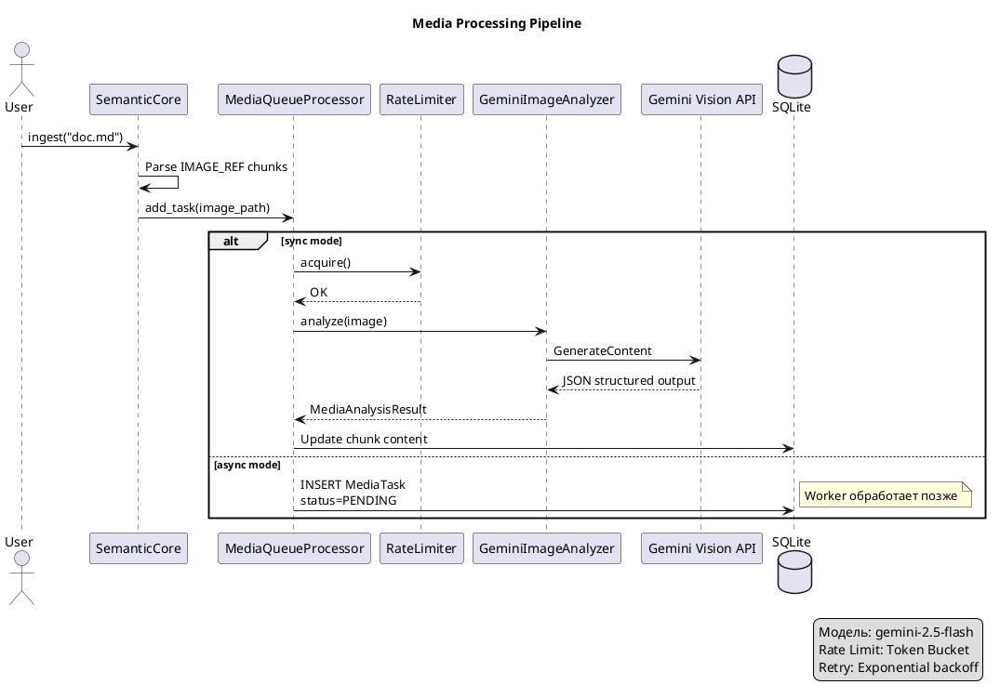

## Что это 📌

**Multimodal Processing** — подсистема для анализа медиафайлов (изображения, аудио, видео) через Gemini API. Результат анализа — текстовое описание, которое векторизуется и участвует в поиске.

| Медиа | Анализатор | Output |
|-------|-----------|--------|
| Image | `GeminiImageAnalyzer` | alt_text, description, keywords, ocr_text |
| Audio | `GeminiAudioAnalyzer` | transcription, summary, speakers |
| Video | `GeminiVideoAnalyzer` | frames analysis + audio transcription |

---

## Зачем нужно 🎯

**Проблема**: Markdown с изображениями/видео — текстовый поиск игнорирует медиа.

**Решение**: Gemini анализирует медиа → текстовое описание → вектор → поиск.

```
Image: diagram.png
  ↓ Gemini Vision
"Architecture diagram showing SemanticCore layers: Domain, Interfaces, Infrastructure"
  ↓ Embedder
Vector[768]
  ↓ Поиск
"архитектура" → найдёт diagram.png!
```

---

## Как работает 🔍



---

## ChunkTypes для медиа ⚙️

| ChunkType | Источник | Metadata |
|-----------|----------|----------|
| `IMAGE_REF` | `` | src, alt, analysis_status |
| `AUDIO_REF` | `[audio](file.mp3)` | src, duration |
| `VIDEO_REF` | `[video](file.mp4)` | src, duration, frame_count |

---

## Structured JSON Output 💡

### Image Analysis Schema

```python
class ImageAnalysisSchema(BaseModel):
    alt_text: str           # "Architecture diagram"
    description: str        # "Diagram showing three layers..."
    keywords: list[str]     # ["architecture", "layers", "diagram"]
    ocr_text: str | None    # "SemanticCore" (текст на картинке)
```

### Audio Analysis Schema

```python
class AudioAnalysisSchema(BaseModel):
    transcription: str      # Полный текст
    summary: str            # Краткое содержание
    speakers: list[str]     # ["Speaker 1", "Speaker 2"]
    language: str           # "ru", "en"
```

---

## Режимы: Sync vs Async ⚙️

| Mode | Latency | Use case |
|------|---------|----------|
| `sync` | Сразу (~2-5 sec) | Интерактивная работа |
| `async` | Очередь | Массовая обработка |

```python
# Sync — результат сразу
result = core.ingest_image(path, mode="sync")

# Async — в очередь
task_id = core.ingest_image(path, mode="async")
# Позже
core.process_media_queue()  # Worker обработает
```

---

## Rate Limiting 📊

**Token Bucket** алгоритм защищает от 429 ошибок:

```python
class TokenBucketRateLimiter:
    def __init__(self, rpm: int = 60):
        self.tokens = rpm
        self.refill_rate = rpm / 60  # tokens/sec
    
    def acquire(self) -> bool:
        """Взять токен или подождать."""
```

| Параметр | Default | Описание |
|----------|---------|----------|
| rpm | 60 | Requests per minute |
| burst | 10 | Максимум накопленных токенов |

---

## MediaTaskModel: персистентная очередь ⚙️

```python
class MediaTaskModel(Model):
    id: int
    chunk_id: int           # FK к Chunk
    media_type: str         # "image", "audio", "video"
    resource_path: str      # Путь к файлу
    status: str             # pending/processing/completed/failed
    result_json: str | None # Результат анализа
    error_message: str | None
    created_at: datetime
    completed_at: datetime | None
```

---

## Оптимизация медиа 📊

### Audio

| Параметр | Рекомендация |
|----------|--------------|
| Bitrate | 32 kbps (достаточно для речи) |
| Format | mp3/m4a |
| Max duration | 83 минуты в одном запросе |

### Video

| Параметр | Рекомендация |
|----------|--------------|
| Frame extraction | 1 fps или keyframes |
| Max frames | 10-20 на запрос |
| Audio track | Извлекается отдельно |

### Image

| Параметр | Рекомендация |
|----------|--------------|
| Max resolution | 1024x1024 (resize) |
| Format | JPEG/PNG/WebP |
| Optimization | 80% quality |

---

## Важные нюансы ⚠️

| Нюанс | Описание |
|-------|----------|
| Модель | `gemini-2.5-flash` (не embedding модель!) |
| Rate limits | 60 RPM для free tier |
| File size | Max 20MB per request |
| Retry | Exponential backoff при 429/500 |
| Dependencies | `poetry install --extras media` |

---

## Связанные темы 🔗

- [Эмбеддинги](01_embeddings.md) — как текст из анализа векторизуется
- [Chunking](04_chunking.md) — IMAGE_REF/AUDIO_REF чанки
- [Batch Processing](06_batch_processing.md) — async mode для очереди
- [Media Processing Guide](../guides/core/media-processing.md) — практическое использование
